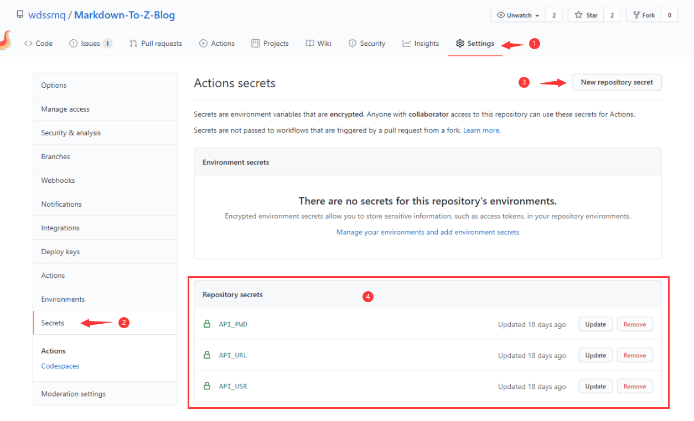

# Markdown-To-Z-Blog

同步*.md 内容到 Z-Blog

使用说明请戳：「[使用说明](#部署 "使用说明")」

---start---

## 目录( 2021 年 10 月 19 日更新)

[「Docker」Nginx 反代探究](https://www.wdssmq.com/post/20211019591.html "「Docker」Nginx 反代探究")

[Docker 内 php-nginx 的伪静态相关](https://www.wdssmq.com/post/20190813019.html "Docker 内 php-nginx 的伪静态相关")

[【真·碎碎念】2021/10/04 ~ 2021/10/10](https://www.wdssmq.com/post/20211013570.html "【真·碎碎念】2021/10/04 ~ 2021/10/10")

[「折腾」RSSerpent 插件笔记](https://www.wdssmq.com/post/20120817543.html "「折腾」RSSerpent 插件笔记")

[2011年1月10日冷笑话合集 - 带褶的馒头](https://www.wdssmq.com/post/2011Nian1Yue10RiLengXiaoHuaHeJi-DaiDeManTou.html "2011年1月10日冷笑话合集 - 带褶的馒头")

[【真·碎碎念】2021/09/20 ~ 2021/09/26](https://www.wdssmq.com/post/20100305270.html "【真·碎碎念】2021/09/20 ~ 2021/09/26")

[「水坑」Z-BlogPHP 应用开发中那些可以自动完成的操作](https://www.wdssmq.com/post/20200105022.html "「水坑」Z-BlogPHP 应用开发中那些可以自动完成的操作")

[「VSCode」远程 CentOS 中 php.validate.executablePath 的设置](https://www.wdssmq.com/post/20211004556.html "「VSCode」远程 CentOS 中 php.validate.executablePath 的设置")

[震惊！原来 Z-Blog 的插件定制是这么报价的！](https://www.wdssmq.com/post/20170422818.html "震惊！原来 Z-Blog 的插件定制是这么报价的！")

[一个有(dou)用(bi)的小工具](https://www.wdssmq.com/post/20150106256.html "一个有(dou)用(bi)的小工具")

[一封男友辞职信及其女友回复](https://www.wdssmq.com/post/20100203886.html "一封男友辞职信及其女友回复")

[紧急出警【爆笑】](https://www.wdssmq.com/post/20100218557.html "紧急出警【爆笑】")

[「杂物」各种陈旧的代码](https://www.wdssmq.com/post/20210923550.html "「杂物」各种陈旧的代码")

[【真·碎碎念】2021/09/13 ~ 2021/09/19](https://www.wdssmq.com/post/20190628106.html "【真·碎碎念】2021/09/13 ~ 2021/09/19")

[「水坑」系列教程索引](https://www.wdssmq.com/post/20200617652.html "「水坑」系列教程索引")

[「折腾」VSCode 语法高亮探索](https://www.wdssmq.com/post/20210316815.html "「折腾」VSCode 语法高亮探索")

[一些能用的 BT Tracker 服务器地址【不定时更新】](https://www.wdssmq.com/post/20130323295.html "一些能用的 BT Tracker 服务器地址【不定时更新】")

[「水坑」Z-BlogPHP 中各种错误提示的复现](https://www.wdssmq.com/post/20200922437.html "「水坑」Z-BlogPHP 中各种错误提示的复现")

[口算题在线生成（可打印）](https://www.wdssmq.com/post/shuxue.html "口算题在线生成（可打印）")

[【真·碎碎念】2021-07-28「特别篇」](https://www.wdssmq.com/post/20120641176.html "【真·碎碎念】2021-07-28「特别篇」")

[【真·碎碎念】2021/09/06 ~ 2021/09/12](https://www.wdssmq.com/post/20210913547.html "【真·碎碎念】2021/09/06 ~ 2021/09/12")

[【真·碎碎念】2021/08/23 ~ 2021/08/29](https://www.wdssmq.com/post/20200620382.html "【真·碎碎念】2021/08/23 ~ 2021/08/29")

[语录啊语录。。](https://www.wdssmq.com/post/2010020739.html "语录啊语录。。")

[【真·碎碎念】2021/08/30 ~ 2021/09/05](https://www.wdssmq.com/post/20191011022.html "【真·碎碎念】2021/08/30 ~ 2021/09/05")

[【言说】不知道发没发的《黑豹》评论](https://www.wdssmq.com/post/20130403328.html "【言说】不知道发没发的《黑豹》评论")

[【笔记】LNMP 部署/续期 SSL 证书](https://www.wdssmq.com/post/20200129996.html "【笔记】LNMP 部署/续期 SSL 证书")

[【折腾】VSCode 远程开发配置（Remote Development）](https://www.wdssmq.com/post/20201120519.html "【折腾】VSCode 远程开发配置（Remote Development）")

[「VSCode」PHP 跨文件夹函数定义提示](https://www.wdssmq.com/post/20200930532.html "「VSCode」PHP 跨文件夹函数定义提示")

[「折腾」ESLint 安装与使用](https://www.wdssmq.com/post/20190917021.html "「折腾」ESLint 安装与使用")

[【真·碎碎念】2021/04/26 ~ 2021/05/02](https://www.wdssmq.com/post/20100305398.html "【真·碎碎念】2021/04/26 ~ 2021/05/02")

[搞笑语录](https://www.wdssmq.com/post/20100205489.html "搞笑语录")

[【真·碎碎念】2021/05/10 ~ 2021/05/16](https://www.wdssmq.com/post/20210506936.html "【真·碎碎念】2021/05/10 ~ 2021/05/16")

[【真·碎碎念】2021/07/26 ~ 2021/08/01](https://www.wdssmq.com/post/20210820126.html "【真·碎碎念】2021/07/26 ~ 2021/08/01")

[「GM_脚本」qBittorrent 批量修改种子 tracker](https://www.wdssmq.com/post/20191117777.html "「GM_脚本」qBittorrent 批量修改种子 tracker")

[「水坑」如何正确的自定义 CSS 样式](https://www.wdssmq.com/post/20190705015.html "「水坑」如何正确的自定义 CSS 样式")

[【列表】上一部](https://www.wdssmq.com/post/20190520228.html "【列表】上一部")

[【折腾】独立博客之「熵」](https://www.wdssmq.com/post/20210227485.html "【折腾】独立博客之「熵」")

---end---

## 致谢

zhaoolee/WordPressXMLRPCTools: 用 Hexo 的方式管理 WordPress

[https://github.com/zhaoolee/WordPressXMLRPCTools](https://github.com/zhaoolee/WordPressXMLRPCTools "zhaoolee/WordPressXMLRPCTools: 用Hexo的方式管理WordPress")

## 部署

[](https://github.com/wdssmq/Markdown-To-Z-Blog/releases/latest "Latest release")

↑ 点击图标链接，下载「md2zbp.zip」文件解压至你的版本库文件夹内；

↓ 修改如下文件项目后即可初始化提交；

> `.github/FUNDING.yml` 「用于设置赞助链接——<a class="img-wrap" target="_blank" title="爱发电-@wdssmq" href="https://afdian.net/@wdssmq"></a>」；
>
> `README.md` 「注：`---start---任意内容---end---`用于插入文章列表，其他内容随意」；
>
> `doc/` 「该文件夹及内部图片如不需要可删除」；

↓ 请阅读后续章节了解如何使用；

## 推荐插件

API 接口扩展 - Z-Blog 应用中心：

[https://app.zblogcn.com/?id=19450](https://app.zblogcn.com/?id=19450 "API接口扩展 - Z-Blog 应用中心")

Markdown 工具 - Z-Blog 应用中心：

[https://app.zblogcn.com/?id=19416](https://app.zblogcn.com/?id=19416 "Markdown工具 - Z-Blog 应用中心")

## 命令（本地测试）

```shell
pip install markdown
pip install requests
pip install python-frontmatter
```

创建 config.json 并按如下示例填写内容：

```json
{
    "API_USR": "zblog_usr",
    "API_PWD": "zblog_pwd",
    "API_URL": "http://zblog.site/zb_system/api.php",
    "DEBUG": 1
}
```

**注：debug 模式需要手动创建`_debug_README.md`并写入`---start---任意内容---end---`。**

运行：

```bash
python api.py
```

## 文章书写

### 存放路径

支持两种形式，需要配图的文章可以创建一个文件夹存放；

**注：版本库内仅用于留存图片，文章内使用需传至图床；**

- _posts/*.md
- _posts/*/doc.md

### 内容格式

- 可以直接复制`_posts/1970-01-01-empty.md`；
- 对于 VSCode ，可以使用快捷命令`ctrl + shift + b`；【2021-02-05】
  - **注：会同时创建文件夹和单文件两种形式，按需改名使用即可；**
  - **注：未改名的会被`.gitignore`排除；**

```md
---
title: 文章标题
tags:
- 标签一
- 标签二
categories:
- 分类名
---

正文段落一

<!--more-->

正文段落二

```

## API 鉴权设置

如图，密码建议使用「md5(密码明文)」；



