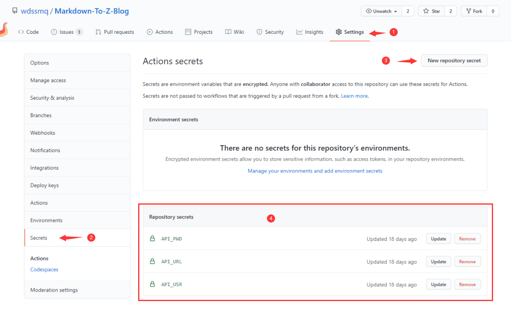

# Markdown-To-Z-Blog

同步*.md 内容到 Z-Blog

使用说明请戳：「[使用说明](#部署 "使用说明")」

---start---

## 目录 -  2026 年 05 月 21 日 更新

[「梦物语」2016 年 11 月 7 日](https://www.wdssmq.com/post/20161107437.html "「梦物语」2016 年 11 月 7 日")

[2010 年 11 月 17 日冷笑话合集 - 竞争与合作](https://www.wdssmq.com/post/2010Nian11Yue17RiLengXiaoHuaHeJi-JingZhengYuHeZuo.html "2010 年 11 月 17 日冷笑话合集 - 竞争与合作")

[应该是差不多了吧。。](https://www.wdssmq.com/post/20130330987.html "应该是差不多了吧。。")

[安卓手机折腾之壁纸篇](https://www.wdssmq.com/post/20130122581.html "安卓手机折腾之壁纸篇")

[为什么纠结【无力吐槽】](https://www.wdssmq.com/post/20120918283.html "为什么纠结【无力吐槽】")

[2013 年 7 月 23 日冷笑话合集 - 卖队友](https://www.wdssmq.com/post/20130723529.html "2013 年 7 月 23 日冷笑话合集 - 卖队友")

[「小代码」搜狗输入法自定义短语分片管理「Python」](https://www.wdssmq.com/post/20221009482.html "「小代码」搜狗输入法自定义短语分片管理「Python」")

[「过往」“狗日的”腾讯](https://www.wdssmq.com/post/20221005708.html "「过往」“狗日的”腾讯")

[「列表」一些电影和小说。。。](https://www.wdssmq.com/post/20100701747.html "「列表」一些电影和小说。。。")

[不知所谓的碎碎念「无力吐槽」](https://www.wdssmq.com/post/20100529960.html "不知所谓的碎碎念「无力吐槽」")

[「备忘」web.config 设置重定向（301）](https://www.wdssmq.com/post/web-configSheZhiZhongDingXiang-301.html "「备忘」web.config 设置重定向（301）")

[2010 年 11 月 12 日冷笑话合集 - 电脑密码](https://www.wdssmq.com/post/2010Nian11Yue12RiLengXiaoHuaHeJi-DianNaoMiMa.html "2010 年 11 月 12 日冷笑话合集 - 电脑密码")

[用五笔打字的人你伤不起啊](https://www.wdssmq.com/post/YongWuBiDaZiDeRenNiShangBuQiA.html "用五笔打字的人你伤不起啊")

[永远在你的手心里](https://www.wdssmq.com/post/20100222174.html "永远在你的手心里")

[2010 年 10 月 15 日冷笑话合集 - 会有的](https://www.wdssmq.com/post/2010Nian10Yue15RiLengXiaoHuaHeJi-HuiYouDe.html "2010 年 10 月 15 日冷笑话合集 - 会有的")

[2010 年 9 月 15 日冷笑话合集 - WinRAR](https://www.wdssmq.com/post/2010Nian9Yue15RiLengXiaoHuaHeJi-WinRAR.html "2010 年 9 月 15 日冷笑话合集 - WinRAR")

[2010 年 9 月 17 日冷笑话合集 - 生鸡蛋和熟鸡蛋](https://www.wdssmq.com/post/2010Nian9Yue17RiLengXiaoHuaHeJi-ShengJiDanHeShuJiDan.html "2010 年 9 月 17 日冷笑话合集 - 生鸡蛋和熟鸡蛋")

[2010 年 9 月 16 日冷笑话合集 - 输入法的杯具](https://www.wdssmq.com/post/2010Nian9Yue16RiLengXiaoHuaHeJi-ShuRuFaDeBeiJu.html "2010 年 9 月 16 日冷笑话合集 - 输入法的杯具")

[没有提醒，您可以出去玩了！](https://www.wdssmq.com/post/20100228244.html "没有提醒，您可以出去玩了！")

[2014 年 3 月 31 日冷笑话合集 - 作者爱上了一个球](https://www.wdssmq.com/post/20140331808.html "2014 年 3 月 31 日冷笑话合集 - 作者爱上了一个球")

[2015 年 7 月 17 日冷笑话合集 - 有话直接说就好](https://www.wdssmq.com/post/20150717934.html "2015 年 7 月 17 日冷笑话合集 - 有话直接说就好")

[2010 年 12 月 6 日冷笑话合集 - 是前奏](https://www.wdssmq.com/post/20101206538.html "2010 年 12 月 6 日冷笑话合集 - 是前奏")

[LOL 玩家分类（英雄联盟中的文普二青年）](https://www.wdssmq.com/post/20120209871.html "LOL 玩家分类（英雄联盟中的文普二青年）")

[男女问题集锦](https://www.wdssmq.com/post/20120621976.html "男女问题集锦")

[2012 年 9 月 11 日冷笑话合集 - 测心跳](https://www.wdssmq.com/post/20100609538.html "2012 年 9 月 11 日冷笑话合集 - 测心跳")

[小明那令人抓狂的汉语试题](https://www.wdssmq.com/post/XiaoMingNaLingRenZhuaKuangDeHanYuShiTi.html "小明那令人抓狂的汉语试题")

[老陈买了辆二手车【幽默故事】](https://www.wdssmq.com/post/20100701358.html "老陈买了辆二手车【幽默故事】")

[历史](https://www.wdssmq.com/post/LiShi.html "历史")

[战国时期名人班级篇](https://www.wdssmq.com/post/ZhanGuoShiQiMingRenBanJiPian.html "战国时期名人班级篇")

[2010 年 9 月 3 日冷笑话合集 - 女 LM 语录](https://www.wdssmq.com/post/2010nian9yue3rixiaohuaheji-nuLMyulu.html "2010 年 9 月 3 日冷笑话合集 - 女 LM 语录")

[语录啊语录。。](https://www.wdssmq.com/post/20100207394.html "语录啊语录。。")

[2011 年 2 月 22 日冷笑话合集 - 名字的含义](https://www.wdssmq.com/post/2011Nian2Yue22RiLengXiaoHuaHeJi-MingZiDeHanYi.html "2011 年 2 月 22 日冷笑话合集 - 名字的含义")

[2012 年 7 月 15 日冷笑话合集 - 想做女人](https://www.wdssmq.com/post/20120715910.html "2012 年 7 月 15 日冷笑话合集 - 想做女人")

[2012 年 7 月 14 日冷笑话合集 - 有心事的人](https://www.wdssmq.com/post/20120714995.html "2012 年 7 月 14 日冷笑话合集 - 有心事的人")

[2010 年 10 月 26 日冷笑话合集 - 结婚纪念日](https://www.wdssmq.com/post/2010Nian10Yue26RiXiaoHuaHeJi-JieHunJiNianRi.html "2010 年 10 月 26 日冷笑话合集 - 结婚纪念日")

[「代码片段」当网页元素可见时……](https://www.wdssmq.com/post/20190701815.html "「代码片段」当网页元素可见时……")

[「杂物」各种陈旧的代码](https://www.wdssmq.com/post/20210923550.html "「杂物」各种陈旧的代码")

---end---

## 致谢

zhaoolee/WordPressXMLRPCTools: 用 Hexo 的方式管理 WordPress

[https://github.com/zhaoolee/WordPressXMLRPCTools](https://github.com/zhaoolee/WordPressXMLRPCTools "zhaoolee/WordPressXMLRPCTools: 用Hexo的方式管理WordPress")

## 部署

[](https://github.com/wdssmq/Markdown-To-Z-Blog/releases/latest "Latest release")

↑ 点击图标链接，下载「md2zbp.zip」文件解压至你的版本库文件夹内；

↓ 修改如下文件项目后即可初始化提交；

> `.github/FUNDING.yml` 「用于设置赞助链接——<a class="img-wrap" target="_blank" title="爱发电-@wdssmq" href="https://afdian.com/@wdssmq"></a>」；
>
> `README.md` 「注：`---start---任意内容---end---`用于插入文章列表，其他内容随意」；
>
> `doc/` 「该文件夹及内部图片如不需要可删除」；

↓ 请阅读后续章节了解如何使用；

## 推荐插件

API 接口扩展 - Z-Blog 应用中心：

[https://app.zblogcn.com/?id=19450](https://app.zblogcn.com/?id=19450 "API接口扩展 - Z-Blog 应用中心")

Markdown 工具 - Z-Blog 应用中心：

[https://app.zblogcn.com/?id=19416](https://app.zblogcn.com/?id=19416 "Markdown工具 - Z-Blog 应用中心")

## 命令（本地测试）

```shell
pip install markdown
pip install requests
pip install python-frontmatter

```

创建 config.json 并按如下示例填写内容：

```json
{
    "API_USR": "zblog_usr",
    "API_PWD": "zblog_pwd",
    "API_URL": "http://zblog.site/zb_system/api.php",
    "DEBUG": 1
}

```

**注：debug 模式需要手动创建`_debug_README.md`并写入`---start---任意内容---end---`。**

运行：

```bash
python api.py

```

## 文章书写

### 存放路径

支持两种形式，需要配图的文章可以创建一个文件夹存放；

**注：配图自动调用见「[#图床](#图床 "图床")」一节；**

- _posts/*.md
- _posts/*/doc.md

### 内容格式

- 可以直接复制`_posts/1970-01-01-empty.md`；
- 对于 VSCode ，可以使用快捷命令`ctrl + shift + b`；【2021-02-05】
  - **注：会同时创建文件夹和单文件两种形式，按需改名使用即可；**
  - **注：未改名的会被`.gitignore`排除；**

```md
---
title: 文章标题
tags:
- 标签一
- 标签二
categories:
- 分类名
---

正文段落一

<!--more-->

正文段落二

```

## 图床

使用 Cloudflare Workers 反代 GitHub；

根据「·参考」内容配置，然后设置如下 secret：

```conf
IMG_HOST=https://img.wdssmq.workers.dev/
; 应以 / 结尾
; 实际也可绑定自己的域名如 https://img.wdssmq.com/
```

图片放置：

```md
_posts
 ├─ 1970-01-01-empty.md
 └─ 2022-04-23-One-Post
     ├─ 001.png
     ├─ 002.png
     ├─ 003.png
     └─ doc.md

```

文章内使用相对地址引用：

```md


```

发布时会尝试替换为：

`https://img.wdssmq.workers.dev/_posts/2022-04-23-One-Post/001.png`

**·参考：**

「折腾」关于 2021 年末仍然没有完备的图床方案这件事\_电脑网络\_沉冰浮水：

[https://www.wdssmq.com/post/20211225085.html](https://www.wdssmq.com/post/20211225085.html "「折腾」关于 2021 年末仍然没有完备的图床方案这件事\_电脑网络\_沉冰浮水")

## API 鉴权设置

如图，密码建议使用「md5(密码明文)」；



