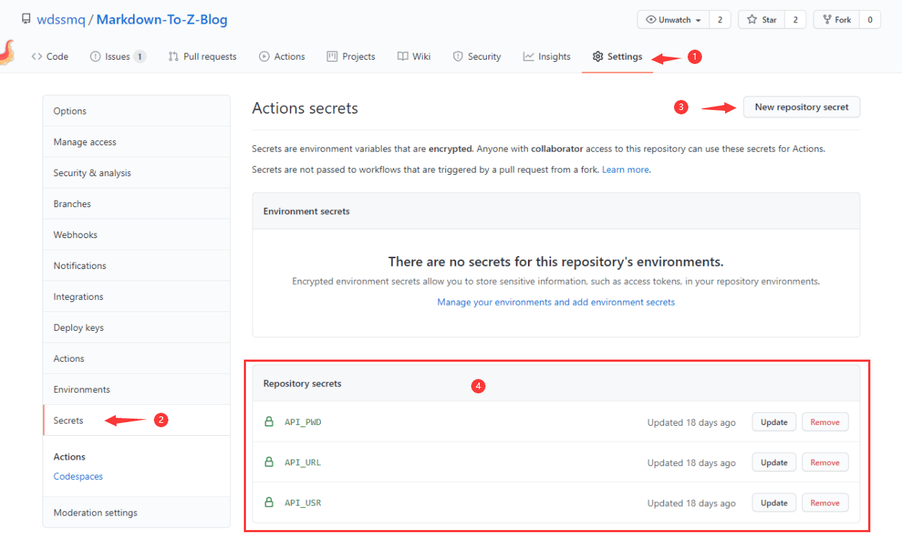

# Markdown-To-Z-Blog

同步*.md 内容到 Z-Blog

使用说明请戳：「[使用说明](#部署 "使用说明")」

---start---

## 目录 -  2026 年 09 月 23 日 更新

[执念「无力吐槽」](https://www.wdssmq.com/post/20121007254.html "执念「无力吐槽」")

[不被需要的碎碎念「无力吐槽」](https://www.wdssmq.com/post/20140829101.html "不被需要的碎碎念「无力吐槽」")

[「代码片段」当网页元素可见时……](https://www.wdssmq.com/post/20190701815.html "「代码片段」当网页元素可见时……")

[「折腾」水水的不想月报](https://www.wdssmq.com/post/20140225001.html "「折腾」水水的不想月报")

[WebDav 折腾「其一」](https://www.wdssmq.com/post/20100514969.html "WebDav 折腾「其一」")

[WebDav 折腾「其二」之 rclone](https://www.wdssmq.com/post/20100203443.html "WebDav 折腾「其二」之 rclone")

[「游戏」整蛊邻居合集下载](https://www.wdssmq.com/post/YouXiZhengGuLinJuHeJiXiaZaiJianTiZhongWen.html "「游戏」整蛊邻居合集下载")

[优化大师很久没更新了啊「无力吐槽」](https://www.wdssmq.com/post/YouHuaDaShiHenJiuMeiGengXinLeAWuLiTuCao.html "优化大师很久没更新了啊「无力吐槽」")

[那些年追女生的 40 个杯具和洗具](https://www.wdssmq.com/post/NaXieNianZhuiNuShengDe40GeBeiJuHeXiJu.html "那些年追女生的 40 个杯具和洗具")

[「玛丽有只小羊羔」“黑暗版”](https://www.wdssmq.com/post/20191201713.html "「玛丽有只小羊羔」“黑暗版”")

[2013 年 8 月 26 日冷笑话合集 - 越狱](https://www.wdssmq.com/post/20130826880.html "2013 年 8 月 26 日冷笑话合集 - 越狱")

[2013 年 8 月 2 日冷笑话合集 - 晚上吃什么](https://www.wdssmq.com/post/20130802172.html "2013 年 8 月 2 日冷笑话合集 - 晚上吃什么")

[无从复盘的过往](https://www.wdssmq.com/post/20191128815.html "无从复盘的过往")

[2010 年 8 月 7 日冷笑话合集 - 心窄 ing](https://www.wdssmq.com/post/2010Nian8Yue7RiXiaoHuaHeJi.html "2010 年 8 月 7 日冷笑话合集 - 心窄 ing")

[2010 年 8 月 6 日冷笑话合集 - 妈妈别哭](https://www.wdssmq.com/post/2010Nian8Yue6RiXiaoHuaHeJi-MaMaBieKu.html "2010 年 8 月 6 日冷笑话合集 - 妈妈别哭")

[2010 年 8 月 5 日冷笑话合集 - 恋爱会计学](https://www.wdssmq.com/post/2010Nian8Yue5RiXiaoHuaHeJi-LianAiHuiJiXue.html "2010 年 8 月 5 日冷笑话合集 - 恋爱会计学")

[2010 年 8 月 3 日冷笑话合集 - 工程](https://www.wdssmq.com/post/2010Nian8Yue3RiLengXiaoHuaHeJi-GongCheng.html "2010 年 8 月 3 日冷笑话合集 - 工程")

[「说点什么」意愿](https://www.wdssmq.com/post/20190517369.html "「说点什么」意愿")

[标题差点重复的碎碎念「无力吐槽」](https://www.wdssmq.com/post/20180915129.html "标题差点重复的碎碎念「无力吐槽」")

[「记录」不谅解的成本！](https://www.wdssmq.com/post/20170610464.html "「记录」不谅解的成本！")

[「无力吐槽」所以好无聊啊！](https://www.wdssmq.com/post/20170529561.html "「无力吐槽」所以好无聊啊！")

[拐杖「小小说」](https://www.wdssmq.com/post/20120714915.html "拐杖「小小说」")

[蝴蝶效应「无厘网文」](https://www.wdssmq.com/post/20100710953.html "蝴蝶效应「无厘网文」")

[我和我「无力吐槽 &amp;amp; 梦物语」](https://www.wdssmq.com/post/20170416263.html "我和我「无力吐槽 &amp;amp; 梦物语」")

[「无力吐槽」知乎的编辑器好垃圾](https://www.wdssmq.com/post/20170511276.html "「无力吐槽」知乎的编辑器好垃圾")

[好久没写的碎碎念「无力吐槽」](https://www.wdssmq.com/post/20150809428.html "好久没写的碎碎念「无力吐槽」")

[2011 年 1 月 16 日冷笑话合集 - 考试周过后](https://www.wdssmq.com/post/2011Nian1Yue16RiLengXiaoHuaHeJi-KaoShiZhouGuoHou.html "2011 年 1 月 16 日冷笑话合集 - 考试周过后")

[2011 年 1 月 17 日冷笑话合集 - 神秘死亡](https://www.wdssmq.com/post/2011Nian1Yue17RiLengXiaoHuaHeJi-ShenMiSiWang.html "2011 年 1 月 17 日冷笑话合集 - 神秘死亡")

[10 分钟的人生「哲理短文」](https://www.wdssmq.com/post/10FenZhongDeRenShengZheLiDuanWen.html "10 分钟的人生「哲理短文」")

[「折腾」CSS 角标文字（失败版）](https://www.wdssmq.com/post/20141212329.html "「折腾」CSS 角标文字（失败版）")

[「GM_脚本」Resilio Sync 密钥/任务导出备份](https://www.wdssmq.com/post/20190130502.html "「GM_脚本」Resilio Sync 密钥/任务导出备份")

[「折腾」pip 安装各种依赖遇到的坑](https://www.wdssmq.com/post/20210224781.html "「折腾」pip 安装各种依赖遇到的坑")

[「PHP 笔记」Call to undefined function curl_init()](https://www.wdssmq.com/post/20201231275.html "「PHP 笔记」Call to undefined function curl_init()")

[「折腾」独立博客之「熵」](https://www.wdssmq.com/post/20210227485.html "「折腾」独立博客之「熵」")

[「小事」换新的键盘终于回来了](https://www.wdssmq.com/post/20140512942.html "「小事」换新的键盘终于回来了")

[「小事」我现在用的搜狗账号，还是当年注册过的那个么？](https://www.wdssmq.com/post/20210418519.html "「小事」我现在用的搜狗账号，还是当年注册过的那个么？")

[「折腾」VSCode 远程开发配置（Remote Development）](https://www.wdssmq.com/post/20201120519.html "「折腾」VSCode 远程开发配置（Remote Development）")

---end---

## 致谢

zhaoolee/WordPressXMLRPCTools: 用 Hexo 的方式管理 WordPress

[https://github.com/zhaoolee/WordPressXMLRPCTools](https://github.com/zhaoolee/WordPressXMLRPCTools "zhaoolee/WordPressXMLRPCTools: 用Hexo的方式管理WordPress")

## 部署

[](https://github.com/wdssmq/Markdown-To-Z-Blog/releases/latest "Latest release")

↑ 点击图标链接，下载「md2zbp.zip」文件解压至你的版本库文件夹内；

↓ 修改如下文件项目后即可初始化提交；

> `.github/FUNDING.yml` 「用于设置赞助链接——<a class="img-wrap" target="_blank" title="爱发电-@wdssmq" href="https://afdian.com/@wdssmq"></a>」；
>
> `README.md` 「注：`---start---任意内容---end---`用于插入文章列表，其他内容随意」；
>
> `doc/` 「该文件夹及内部图片如不需要可删除」；

↓ 请阅读后续章节了解如何使用；

## 推荐插件

API 接口扩展 - Z-Blog 应用中心：

[https://app.zblogcn.com/?id=19450](https://app.zblogcn.com/?id=19450 "API接口扩展 - Z-Blog 应用中心")

Markdown 工具 - Z-Blog 应用中心：

[https://app.zblogcn.com/?id=19416](https://app.zblogcn.com/?id=19416 "Markdown工具 - Z-Blog 应用中心")

## 命令（本地测试）

```shell
pip install markdown
pip install requests
pip install python-frontmatter

```

创建 config.json 并按如下示例填写内容：

```json
{
    "API_USR": "zblog_usr",
    "API_PWD": "zblog_pwd",
    "API_URL": "http://zblog.site/zb_system/api.php",
    "DEBUG": 1
}

```

**注：debug 模式需要手动创建`_debug_README.md`并写入`---start---任意内容---end---`。**

运行：

```bash
python api.py

```

## 文章书写

### 存放路径

支持两种形式，需要配图的文章可以创建一个文件夹存放；

**注：配图自动调用见「[#图床](#图床 "图床")」一节；**

- _posts/*.md
- _posts/*/doc.md

### 内容格式

- 可以直接复制`_posts/1970-01-01-empty.md`；
- 对于 VSCode ，可以使用快捷命令`ctrl + shift + b`；【2021-02-05】
  - **注：会同时创建文件夹和单文件两种形式，按需改名使用即可；**
  - **注：未改名的会被`.gitignore`排除；**

```md
---
title: 文章标题
tags:
- 标签一
- 标签二
categories:
- 分类名
---

正文段落一

<!--more-->

正文段落二

```

## 图床

使用 Cloudflare Workers 反代 GitHub；

根据「·参考」内容配置，然后设置如下 secret：

```conf
IMG_HOST=https://img.wdssmq.workers.dev/
; 应以 / 结尾
; 实际也可绑定自己的域名如 https://img.wdssmq.com/
```

图片放置：

```md
_posts
 ├─ 1970-01-01-empty.md
 └─ 2022-04-23-One-Post
     ├─ 001.png
     ├─ 002.png
     ├─ 003.png
     └─ doc.md

```

文章内使用相对地址引用：

```md


```

发布时会尝试替换为：

`https://img.wdssmq.workers.dev/_posts/2022-04-23-One-Post/001.png`

**·参考：**

「折腾」关于 2021 年末仍然没有完备的图床方案这件事\_电脑网络\_沉冰浮水：

[https://www.wdssmq.com/post/20211225085.html](https://www.wdssmq.com/post/20211225085.html "「折腾」关于 2021 年末仍然没有完备的图床方案这件事\_电脑网络\_沉冰浮水")

## API 鉴权设置

如图，密码建议使用「md5(密码明文)」；



