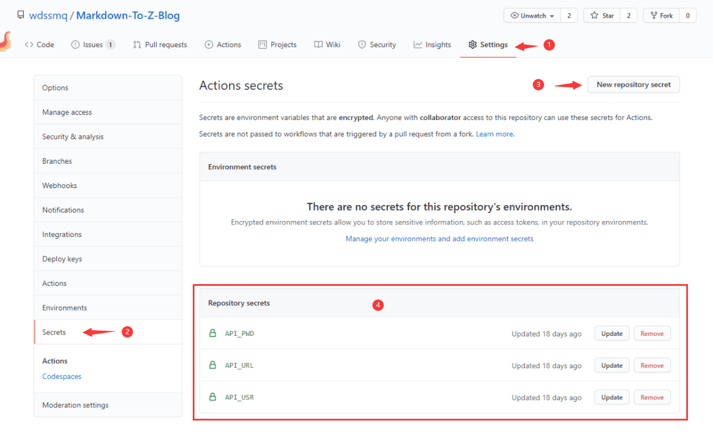

# Markdown-To-Z-Blog

同步*.md 内容到 Z-Blog

使用说明请戳：「[使用说明](#部署 "使用说明")」

---start---

## 目录 -  2026 年 10 月 09 日 更新

[「水坑」关于时不时需要向人解释什么是「个人网站」这种事](https://www.wdssmq.com/post/20210828777.html "「水坑」关于时不时需要向人解释什么是「个人网站」这种事")

[「水坑」一些 SQL 语句](https://www.wdssmq.com/post/20120816277.html "「水坑」一些 SQL 语句")

[「折腾」Docker 化部署 lighttpd 并安装 Z-BlogPHP](https://www.wdssmq.com/post/20210804429.html "「折腾」Docker 化部署 lighttpd 并安装 Z-BlogPHP")

[「GM_脚本」度盘分享文件时自动复制为 HTML 或 MarkDown](https://www.wdssmq.com/post/20220412172.html "「GM_脚本」度盘分享文件时自动复制为 HTML 或 MarkDown")

[「坑货笔记」零宽空白 &amp;amp;#8203; 是什么鬼！](https://www.wdssmq.com/post/20190818266.html "「坑货笔记」零宽空白 &amp;amp;#8203; 是什么鬼！")

[一些能用的 BT Tracker 服务器地址「不定时更新」](https://www.wdssmq.com/post/20130323295.html "一些能用的 BT Tracker 服务器地址「不定时更新」")

[「折腾」Python + GitHub Actions 更新 Z-Blog 的探索](https://www.wdssmq.com/post/20210129918.html "「折腾」Python + GitHub Actions 更新 Z-Blog 的探索")

[「折腾」Linux 定时备份教程](https://www.wdssmq.com/post/20140816860.html "「折腾」Linux 定时备份教程")

[口算题在线生成（可打印）](https://www.wdssmq.com/post/shuxue.html "口算题在线生成（可打印）")

[「备忘」JavaScript 队列执行异步任务](https://www.wdssmq.com/post/20210529408.html "「备忘」JavaScript 队列执行异步任务")

[「VPS」HostNamaste $20 年付优惠](https://www.wdssmq.com/post/20220331233.html "「VPS」HostNamaste $20 年付优惠")

[「折腾」VSCode + wsl2 + Docker 探究](https://www.wdssmq.com/post/20220211184.html "「折腾」VSCode + wsl2 + Docker 探究")

[「言说」仍然找不准自己定位的水水](https://www.wdssmq.com/post/20210403155.html "「言说」仍然找不准自己定位的水水")

[「折腾」Linux(CentOS)安装 Python](https://www.wdssmq.com/post/20210224695.html "「折腾」Linux(CentOS)安装 Python")

[使用 GitHub Actions + Markdown 更新 Z-Blog 博客](https://www.wdssmq.com/post/20210224498.html "使用 GitHub Actions + Markdown 更新 Z-Blog 博客")

[「言说」相对擅长写代码，然而也只有写代码](https://www.wdssmq.com/post/20210224671.html "「言说」相对擅长写代码，然而也只有写代码")

[「折腾」基于 Node 的 QQ 机器人项目](https://www.wdssmq.com/post/20210101974.html "「折腾」基于 Node 的 QQ 机器人项目")

[「言说」RSS 是一种态度！！](https://www.wdssmq.com/post/20201231613.html "「言说」RSS 是一种态度！！")

[「VSCode 笔记」Git: Host key verification failed](https://www.wdssmq.com/post/20201216004.html "「VSCode 笔记」Git: Host key verification failed")

[「折腾」VSCode 远程开发配置（Remote Development）](https://www.wdssmq.com/post/20201120519.html "「折腾」VSCode 远程开发配置（Remote Development）")

[「折腾」GitHub Actions 反代 RSSHub + 多实例轮询](https://www.wdssmq.com/post/20100309739.html "「折腾」GitHub Actions 反代 RSSHub + 多实例轮询")

[「GM_脚本」复制任意网页的标题+网址，支持 HTML 及 MarkDown](https://www.wdssmq.com/post/20201104429.html "「GM_脚本」复制任意网页的标题+网址，支持 HTML 及 MarkDown")

[「言说」停不下的写作和代码](https://www.wdssmq.com/post/20210205073.html "「言说」停不下的写作和代码")

[2019，又一个十年的开始与结束「说点什么」](https://www.wdssmq.com/post/20190105756.html "2019，又一个十年的开始与结束「说点什么」")

[不能邮箱登录的网站都是耍流氓「无力吐槽」](https://www.wdssmq.com/post/20140507140.html "不能邮箱登录的网站都是耍流氓「无力吐槽」")

[「折腾」使用 Quicker 拆分文件到子文件夹](https://www.wdssmq.com/post/20120827310.html "「折腾」使用 Quicker 拆分文件到子文件夹")

[「P2P」从 BitComet 生成的种子中获取 ed2k](https://www.wdssmq.com/post/20131014380.html "「P2P」从 BitComet 生成的种子中获取 ed2k")

[「Z-Blog 玩家」计划](https://www.wdssmq.com/post/20210401133.html "「Z-Blog 玩家」计划")

[网速超不给力啊「梦物语」](https://www.wdssmq.com/post/20100208911.html "网速超不给力啊「梦物语」")

[「梦物语」2016 年 11 月 7 日](https://www.wdssmq.com/post/20161107437.html "「梦物语」2016 年 11 月 7 日")

[「折腾」VSCode 语法高亮探索](https://www.wdssmq.com/post/20210316815.html "「折腾」VSCode 语法高亮探索")

[MKV 内置字幕提取/字幕编辑工具推荐](https://www.wdssmq.com/post/20120727734.html "MKV 内置字幕提取/字幕编辑工具推荐")

[「备忘」再再次谈系统安装「2021」](https://www.wdssmq.com/post/20120622915.html "「备忘」再再次谈系统安装「2021」")

[「折腾」GM_脚本修改 bilibili 番剧链接为我的追番](https://www.wdssmq.com/post/20100222433.html "「折腾」GM_脚本修改 bilibili 番剧链接为我的追番")

[「图说」右键菜单栏工具什么的「2022-05」](https://www.wdssmq.com/post/20120915760.html "「图说」右键菜单栏工具什么的「2022-05」")

[合并了 Typecho 文章到 Z-Blog](https://www.wdssmq.com/post/20200905897.html "合并了 Typecho 文章到 Z-Blog")

[EasyPHP - 略有极客感的 WEB 环境工具](https://www.wdssmq.com/post/20210224528.html "EasyPHP - 略有极客感的 WEB 环境工具")

---end---

## 致谢

zhaoolee/WordPressXMLRPCTools: 用 Hexo 的方式管理 WordPress

[https://github.com/zhaoolee/WordPressXMLRPCTools](https://github.com/zhaoolee/WordPressXMLRPCTools "zhaoolee/WordPressXMLRPCTools: 用Hexo的方式管理WordPress")

## 部署

[](https://github.com/wdssmq/Markdown-To-Z-Blog/releases/latest "Latest release")

↑ 点击图标链接，下载「md2zbp.zip」文件解压至你的版本库文件夹内；

↓ 修改如下文件项目后即可初始化提交；

> `.github/FUNDING.yml` 「用于设置赞助链接——<a class="img-wrap" target="_blank" title="爱发电-@wdssmq" href="https://afdian.com/@wdssmq"></a>」；
>
> `README.md` 「注：`---start---任意内容---end---`用于插入文章列表，其他内容随意」；
>
> `doc/` 「该文件夹及内部图片如不需要可删除」；

↓ 请阅读后续章节了解如何使用；

## 推荐插件

API 接口扩展 - Z-Blog 应用中心：

[https://app.zblogcn.com/?id=19450](https://app.zblogcn.com/?id=19450 "API接口扩展 - Z-Blog 应用中心")

Markdown 工具 - Z-Blog 应用中心：

[https://app.zblogcn.com/?id=19416](https://app.zblogcn.com/?id=19416 "Markdown工具 - Z-Blog 应用中心")

## 命令（本地测试）

```shell
pip install markdown
pip install requests
pip install python-frontmatter

```

创建 config.json 并按如下示例填写内容：

```json
{
    "API_USR": "zblog_usr",
    "API_PWD": "zblog_pwd",
    "API_URL": "http://zblog.site/zb_system/api.php",
    "DEBUG": 1
}

```

**注：debug 模式需要手动创建`_debug_README.md`并写入`---start---任意内容---end---`。**

运行：

```bash
python api.py

```

## 文章书写

### 存放路径

支持两种形式，需要配图的文章可以创建一个文件夹存放；

**注：配图自动调用见「[#图床](#图床 "图床")」一节；**

- _posts/*.md
- _posts/*/doc.md

### 内容格式

- 可以直接复制`_posts/1970-01-01-empty.md`；
- 对于 VSCode ，可以使用快捷命令`ctrl + shift + b`；【2021-02-05】
  - **注：会同时创建文件夹和单文件两种形式，按需改名使用即可；**
  - **注：未改名的会被`.gitignore`排除；**

```md
---
title: 文章标题
tags:
- 标签一
- 标签二
categories:
- 分类名
---

正文段落一

<!--more-->

正文段落二

```

## 图床

使用 Cloudflare Workers 反代 GitHub；

根据「·参考」内容配置，然后设置如下 secret：

```conf
IMG_HOST=https://img.wdssmq.workers.dev/
; 应以 / 结尾
; 实际也可绑定自己的域名如 https://img.wdssmq.com/
```

图片放置：

```md
_posts
 ├─ 1970-01-01-empty.md
 └─ 2022-04-23-One-Post
     ├─ 001.png
     ├─ 002.png
     ├─ 003.png
     └─ doc.md

```

文章内使用相对地址引用：

```md


```

发布时会尝试替换为：

`https://img.wdssmq.workers.dev/_posts/2022-04-23-One-Post/001.png`

**·参考：**

「折腾」关于 2021 年末仍然没有完备的图床方案这件事\_电脑网络\_沉冰浮水：

[https://www.wdssmq.com/post/20211225085.html](https://www.wdssmq.com/post/20211225085.html "「折腾」关于 2021 年末仍然没有完备的图床方案这件事\_电脑网络\_沉冰浮水")

## API 鉴权设置

如图，密码建议使用「md5(密码明文)」；



