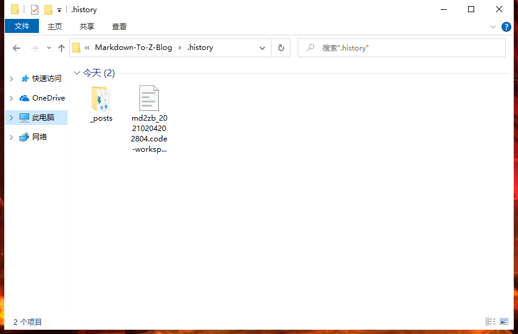
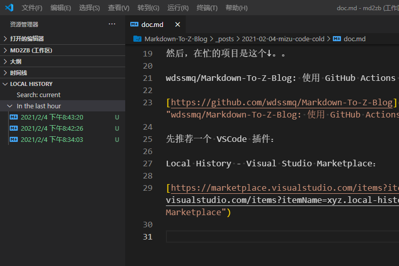
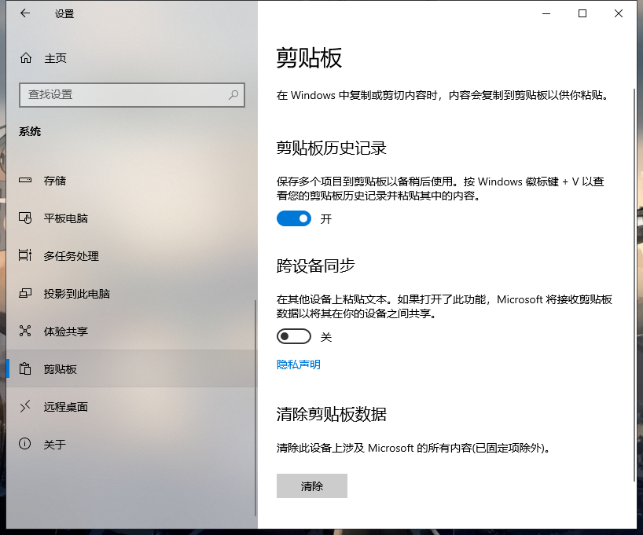

对某名群名的「说教」：

> 这两天确实忙是一方面，，其实另一方面我在你身上明确看到了“左脚绊右脚”的教课书级的示范
>
> 某种概念上，付费并不是单单买服务，，而是买对方的包容，，（比如你给的够多的话我肯定不会在闲下来后就开始对你碎碎念）你的需要我会免费帮你看，，但是要成为我下一篇博文的素材中的「某用户」，

<!--more-->

然后，在忙的项目是这个↓。。

wdssmq/Markdown-To-Z-Blog: 使用 GitHub Actions + Markdown 更新 Z-Blog 博客。：

[https://github.com/wdssmq/Markdown-To-Z-Blog](https://github.com/wdssmq/Markdown-To-Z-Blog "wdssmq/Markdown-To-Z-Blog: 使用 GitHub Actions + Markdown 更新 Z-Blog 博客。")

---

先推荐一个 VSCode 插件：

Local History - Visual Studio Marketplace：

[https://marketplace.visualstudio.com/items?itemName=xyz.local-history](https://marketplace.visualstudio.com/items?itemName=xyz.local-history "Local History - Visual Studio Marketplace")

使用效果类似这样：

<!--  -->

和这样：

<!--  -->

对于 win10 自身，则有这个选项：

<!--  -->

其实已经有一段时间了，不知道是不是键盘略旧的原因，`ctrl + *` 相关的组合键有很大概率触发多次，所在在剪切时会先把选择的内容剪切一次，然后再剪切一次空值，粘贴时就会出现杯具。。。

编辑器不关闭文件的话可以通过撤销插件恢复，然后今天终于在一次剪切操作后关掉了。。关掉了。。

而就在两天前我把移动硬盘扔洗衣机洗了。。。emmm。。

---

所以现在要凭记忆重写一遍弄丢的文本。。。。

因为宝塔面板和各种大厂的云服务，Nginx 的比例应该是有增加，IIS 顺带。因为「主流认知」里还是 Linux 更适合作为建站服务器。

云服务盛行，导致很多新用户开局就使用 VPS 级别的空间，哪怕并不需要，，或者说对价格不敏感的群体可能都不知道还有虚拟主机可以使用，可以类比 U 盘的价格和容量。。

因为「主流认知」的影响，新用户也更多的选用 Linux 系统，或者说，对于服务器端的系统，Linux 和 Windows 的难度等级是差不多的？【【其实更多的还是因为能 Windows 的空间要贵一些吧.jpg】】

即使是 Linux，宝塔面板也很大程度上降低了使用门槛，之后是用 Nginx 还是 Apache 则由用户自行选择，一定程度上应该是较均衡的。【【个人主观上好像 Nginx 更多一些？】】

在虚拟主机占比更多的时代基本上都是 IIS 6 和 Apache，虽然 IIS 上 PHP 和 ASP 都可以跑，然而除非用户真的是来跑 ASP，否则还是应该 Apache 的几率更大一些。

事实上个人认为在那个时期，（对于虚拟主机类型） IIS 7 才是最好的建站环境（含 7.5），然而 ASP 终究式微，而当时的价格也比现在很多云主机要贵了。。

【【旧言：个人习惯上将【网站运行环境】统称为【空间】，大致分为【独立服务器】【VPS】【虚拟主机】三种，名字中带`云`的其实精略来说也超不出这三种。。】】
