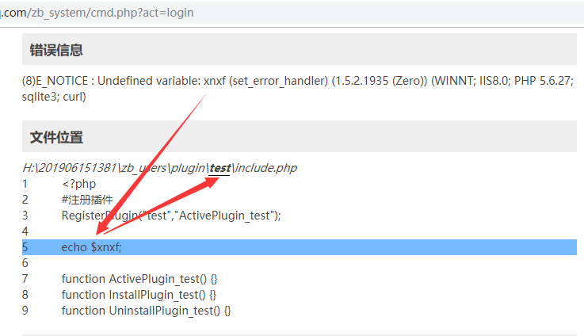
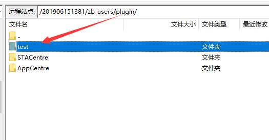

> “如何实现……如何解决……”这类问题真心很难回答。。然而还是要保持微笑。

\-----------

1、网站设置→全局设置→开发模式；

<!--more-->

**2、找到相应代码的作者，寻求解决；←←←这条应该永远是优先选项和共识**

3、代码层面未能及时得到修复，或者需要优先恢复网站运行时，进 FTP 删除相应插件；

<!--  -->

<!--  -->

删除是最省事的，，实上建议改名文件夹；

如果插件比较多的话，可以照可疑程度依次或半数操作。

改名后能进后台了，那么说明有问题的在已经改名的那部分里。。

<!--340-->
