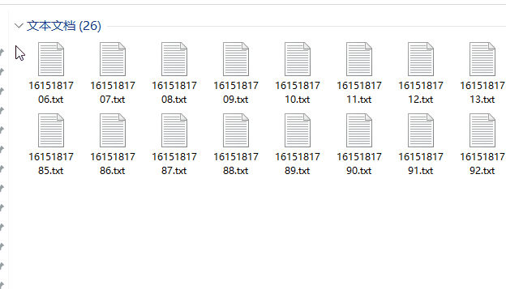

分享一个 Quicker 脚本动作，功能是将选中的文件自动移动到子文件夹内，子文件夹使用当前时间命名；

相当于特定动作的 DropIt；

<!--more-->

### 一段 Bash 脚本

```bash
for((i=1;i<=200;i++));
do
echo `date +%s` > `date +%s`.txt
done
```

目的是批量生成用于测试的文件，并不严谨；


### 需求描述

某个文件夹下有众多的文件，希望可以拆分到子文件夹内，子文件夹名用当前时间，形式为：`2021-03-08-13-47-56`。

虽然用过「DropIt」，但是不太好精准的自定义；


### 动作分享

移入新文件夹（时间命名） - 已分享的动作 - Quicker：

[https://getquicker.net/Sharedaction?code=1ccf06a9-00ad-43ef-0daa-08d8e1981b2c](https://getquicker.net/Sharedaction?code=1ccf06a9-00ad-43ef-0daa-08d8e1981b2c "移入新文件夹（时间命名） - 已分享的动作 - Quicker")


### 使用

目前需要「手动选择一定数量的文件」后呼出面板或轮盘后触发动作；

进阶操作还需要慢慢摸索；【【主要是懒】】

理想的效果：

- 可选中全部文件后执行；
- 按文件名排序遍历，每 N 篇移入一个新文件夹；
- 文件夹自动编号递增；


### 演示

<!--  -->


### 广告时间

Quicker：[https://getquicker.net/](https://getquicker.net/ "Quicker 软件 您的指尖工具箱 - Quicker")

**推荐码：105131-1635**

沉冰浮水正在创作和 z-blog 相关或无关的各种有用或没用的代码 | 爱发电：

[https://www.afdian.net/@wdssmq](https://www.afdian.net/@wdssmq "沉冰浮水正在创作和 z-blog 相关或无关的各种有用或没用的代码 | 爱发电")
