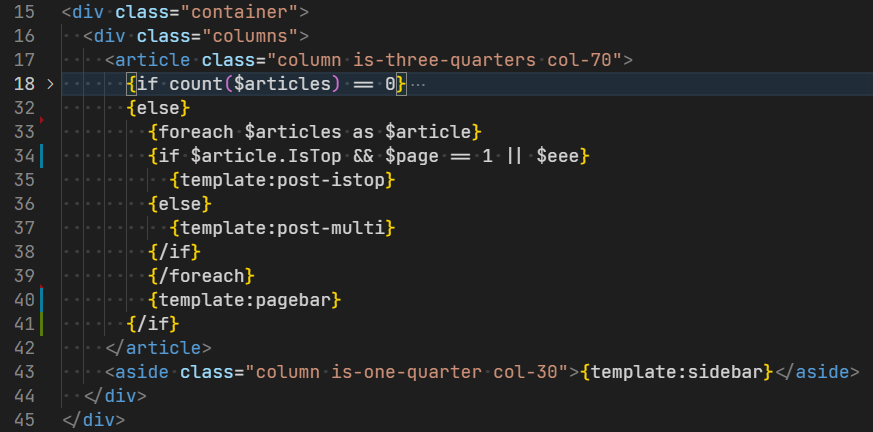
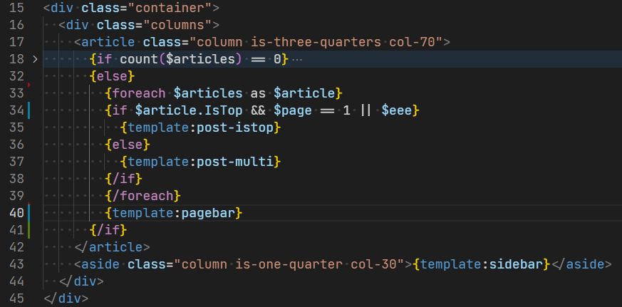
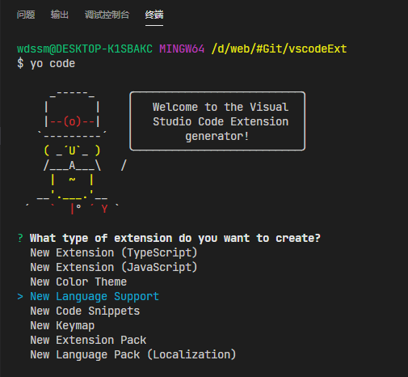
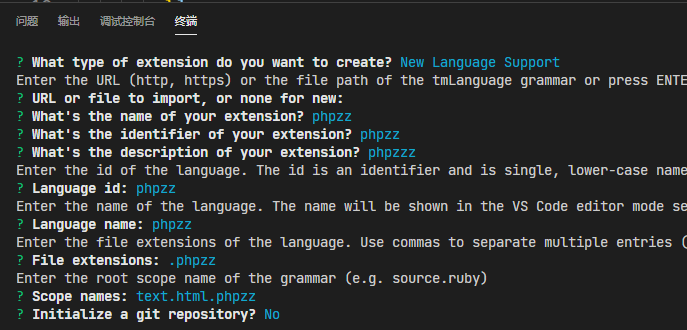
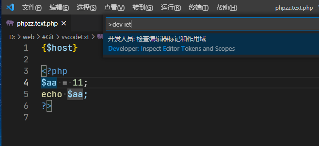
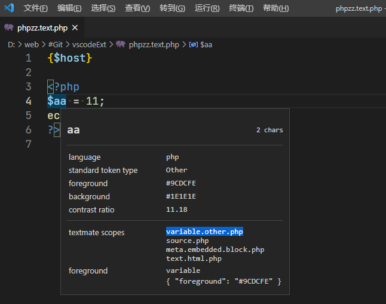

Z-BlogPHP 主题模板中并没有像 WordPress 或 Typecho 那样直接使用 PHP 语法，而是经过简化的，运行时再“编译”为 PHP 使用，优点是键入字符数量大幅减少，缺点是，，，没有高亮；

<!--more-->

// 第二天的补充 - 开始

**目前折腾过的最复杂的东西之一，有点像`CSS`又感觉不太准确，写到一多半才突然想明白怎么通俗的理解其机制，然而临下机只能先提交一次；**

【【突然想起来我可以只提交不推送的。。。】】

**个人总结到的类比是「地毯」和「叠 Buff」两部分，只有「叠 Buff」的部分可以直接类比`CSS`**

// 第二天的补充 - 结束


↓↓ 不知道下边代码在网页内的语法亮度是什么效果：

```php
<?php
// 标准 PHP 标记包含的部分会在编译时过滤掉
$aa = 1;
?>
{php}
// 可以在这里写 PHP 代码，但是同样没有高亮；
$bb == 2;
{/php}
{$bb}
{if count($articles) > 0}
  {foreach $articles as $article}
  {if $article.IsTop}
    {template:post-istop}
  {else}
    {template:post-multi}
  {/if}
  {/foreach}
  {template:pagebar}
{/if}
```
<!--  -->


<!--  -->


「- -」「- -」「- -」

> [你的第一个插件 - VS Code 插件创作中文开发文档](https://liiked.github.io/VS-Code-Extension-Doc-ZH/#/get-started/your-first-extension "你的第一个插件 - VS Code 插件创作中文开发文档")

需要会用 npm 并且建议使用 cnpm；

```bash
cnpm install -g yo generator-code
yo code
```

请在 VSCode 终端中执行 `yo code` 命令；

<!--  -->


「- ↑ -」`New Language Support`「- ↑ -」

<!--  -->


键入项依次说明：

- 从网址导入已有项目，直接回车留空；
- 「name」，对应`package.json`中的`displayName`；
- 「identifier」，对应`package.json`中的`name`，同时也是插件项目的文件夹名；
- 「description」，对应`package.json`中的`description`；
- `Language id`、`Language name`、`File extensions` ；
    - 这三项用于针对特定的文件后缀指定其语言类别；
- 「Scope names」这里使用`text.html.phpzz`，后边会解释怎么理解这个字段；

「- -」「- -」「- -」

默认生成的 `package.json` 中的核心部分如下：

```json
{
  "contributes": {
    "languages": [{
        "id": "phpzz",
        "aliases": ["phpzz", "phpzz"],
        "extensions": [".phpzz"],
        "configuration": "./language-configuration.json"
    }],
    "grammars": [{
        "language": "phpzz",
        "scopeName": "text.html.phpzz",
        "path": "./syntaxes/phpzz.tmLanguage.json"
    }]
  }
}
```

虽然不知道理解的是否对：

- `languages`中定义「语言」，包括将哪种后缀的文件识别为这种「语言」；
    - 常见的语言有：`html`、`php`、 `css`等；
    - 本例中不需要定义一种语言，而是要在`html`的基础上对其中的 Z-Blog 语法部分进行额外着色；
- `grammars`中定义「语法方案」，并声明该「语法方案」将应用于哪种「语言」；
    - 语法规则放在`path`字段指定的文件中，内容格式为「json」，用来定义「TextMate」语法描述；
    - `scopeName`：
        - 本例中`phpzz`用于补充`html`（语法注入），可理解为给`text.html`增加一个「子集」；
        - 如果是单独定义新的语法，命名则是`source.phpzz`；
        - **重要：必须和`tmLanguage`文件中的`scopeName`字段一样；**

所以修改`package.json`内容：

```json
{
  "contributes": {
    "grammars": [{
        "scopeName": "text.html.phpzz",
        "path": "./syntaxes/phpzz.tmLanguage.json",
        "injectTo": [
          "text.html"
        ]
    }]
  }
}
```

↑ `injectTo`指定当前「语法方案」用于向`text.html`「注入」

「- -」「- -」「- -」

「TextMate（tmLanguage）」语法说明：

VSCode 读取使用时要求`json`文件，然而并不方便阅读和更新，实际建议用`Yaml`来写，然后用`js-yaml`进行转换后使用；

```bash
# 安装 js-yaml
cnpm install js-yaml --save-dev
# 转换文件
npx js-yaml syntaxes/phpzz.tmLanguage.yaml > syntaxes/phpzz.tmLanguage.json
```

成品见：

> wdssmq/z-blog-color: zbp 模板语法高亮（VSCode 插件）：
>
> [https://github.com/wdssmq/z-blog-color](https://github.com/wdssmq/z-blog-color "wdssmq/z-blog-color: zbp 模板语法高亮（VSCode 插件）")

以下仅为要点理解：

- `injectionSelector: L:text.html`：「语法注入」生效的「作用域」指定；
    -  注入选择器中的`L:`代表注入的语法添加在现有语法规则的左边；【【不是很懂，文档上就是这么写的】】
    -  个人理解：当编辑器文本「站在名为`text.html.xxx`地毯上时」,后边的内容生效；
        - 包括`text.html.php`、`text.html.markdown`等；
        - 其他「最底层地毯」有`source.css`、`source.js`等；
        - `source.php`比较特殊，默认情况下是铺在`text.html.php`上边的，中间还隔了层`meta.embedded.block.php`；
- `repository`中声明「语法定义」，`patterns`则调用这些定义；
- 「语法定义」的要点是，按规则匹配编辑器内的文本（主要是正则），然后给匹配到的「文本区域」命名，最后根据命名规则应用相应的颜色样式；
  - 样式一般由所使用的「主题」提供，类似`*.css`文件，而命名则是`class="XXX"`；
  - 以`keyword.control.php`为例：
      - 从右到左依次检索样式定义：`keyword.control.php`，`keyword.control`，`keyowrd`；
      - 返回能够匹配到的最长的样式定义，这里实际返回的是`keyword.control`；
  - `variable.other.php` 实际生效的样式是 `variable`；
  - `constant.language.php`实际生效的样式是`constant.language`;
- 或者可以匹配文本内容的开始和结束，然后对其内的区域应用指定「语法定义」；

<details markdown='1'><summary><code>phpzz.tmLanguage.yaml</code>内容示意：</summary>

```yaml
name: phpzz
scopeName: text.html.phpzz
injectionSelector: L:text.html
patterns:
  - include: "#phpzz-block"
  - include: "#phpzz-echo"
repository:
  phpzz-block:
    begin: "{(php)}"
    beginCaptures:
      "0":
        name: phpzz.block.begin
      "1":
        name: keyword.control.php
    end: "{(/php)}"
    endCaptures:
      "0":
        name: phpzz.block.end
      "1":
        name: keyword.control.php
    patterns:
      - include: source.php
  phpzz-echo:
    patterns:
      - name: phpzz.variable
        match: '{(\$[^}\s]+)}'
        captures:
          "1":
            name: variable.other.php
      - name: phpzz.include
        match: '{(template):([^}\s]+)}'
        captures:
          "1":
            name: constant.language.php
          "2":
            name: variable.other.php
```
</details>

「- -」「- -」「- -」

VS Code 自带的作用域检查器能帮你调试语法文件。它能显示当前位置符号作用域，以及应用在上面的主题规则和元信息。

在命令面板中输入`Developer: Inspect Editor Tokens and Scopes`：

<!--  -->


<!--  -->


- `textmate scopes` 中就是光标所在位置下的「每一层地毯」：
    - 对于`php`语言，整个文件内都是`text.html.php`（最底层）；
    - `<?php ?>`区域则是`meta.embedded.block.php`，内部是`source.php`；
    - `variable.other.php`是「最上层」，实际生效的样式由这里决定；
- `foreground`中显示实际生效的样式是定义在`variable`上的，自定义使用时后边的部分可以省略或者修改（作为备注标识）；
