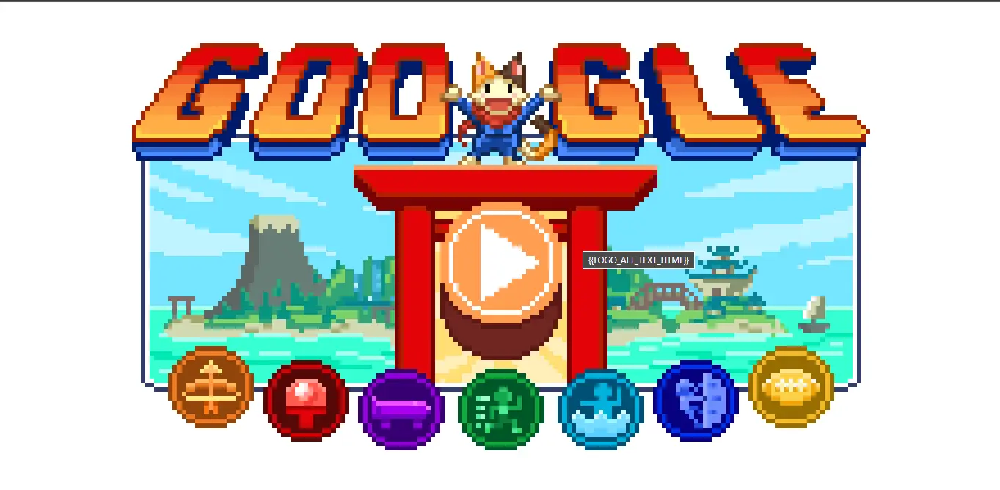
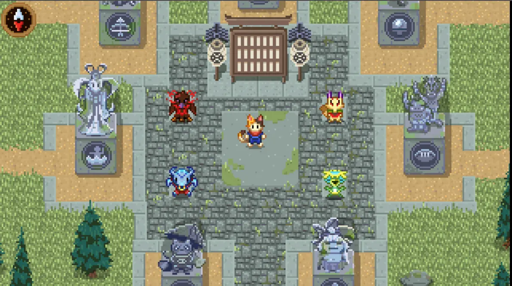
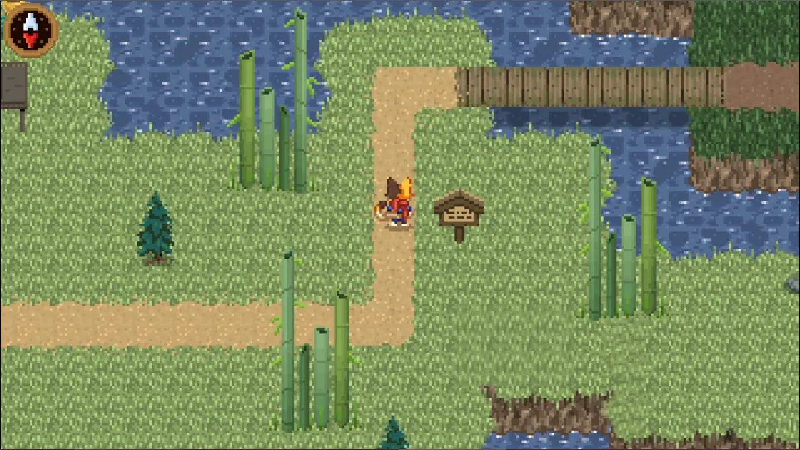
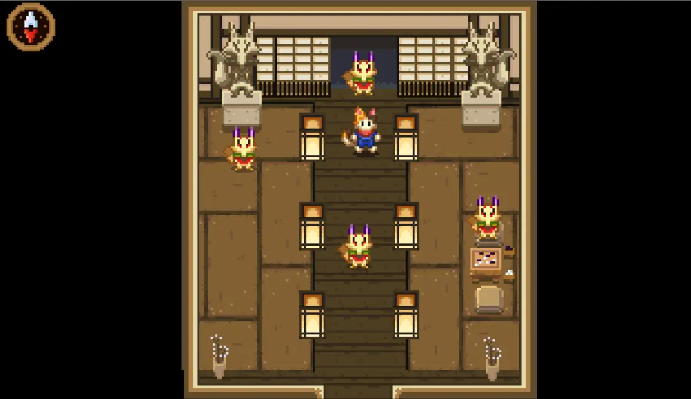
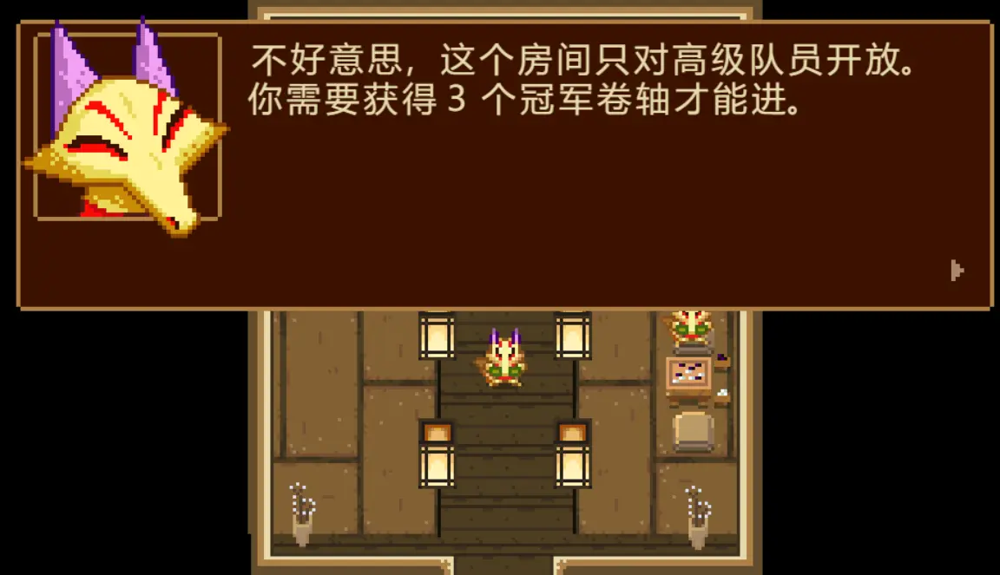
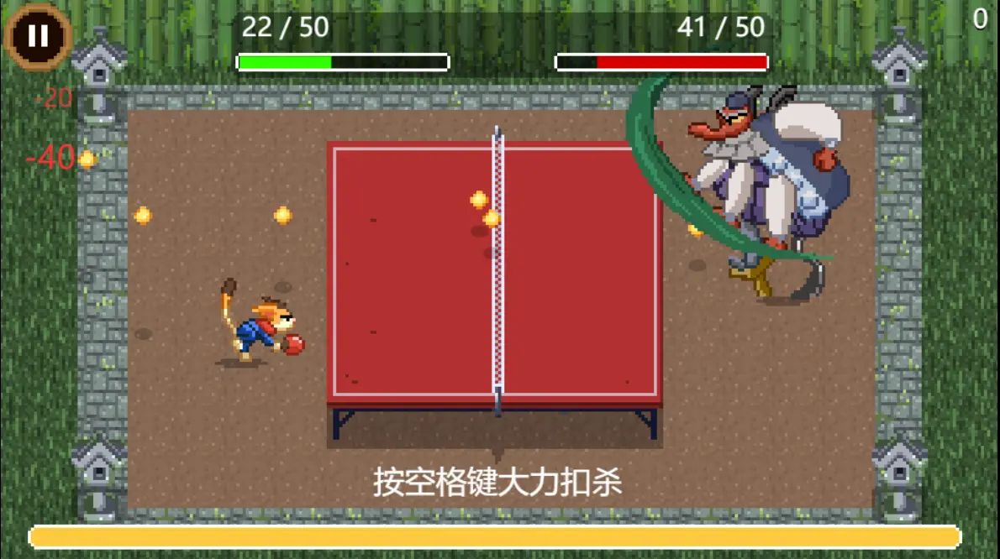
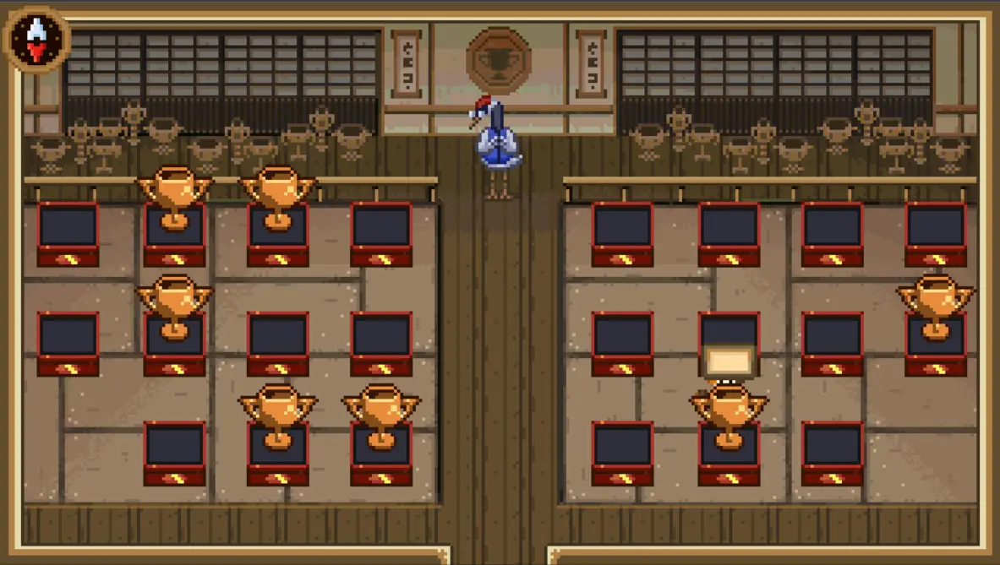
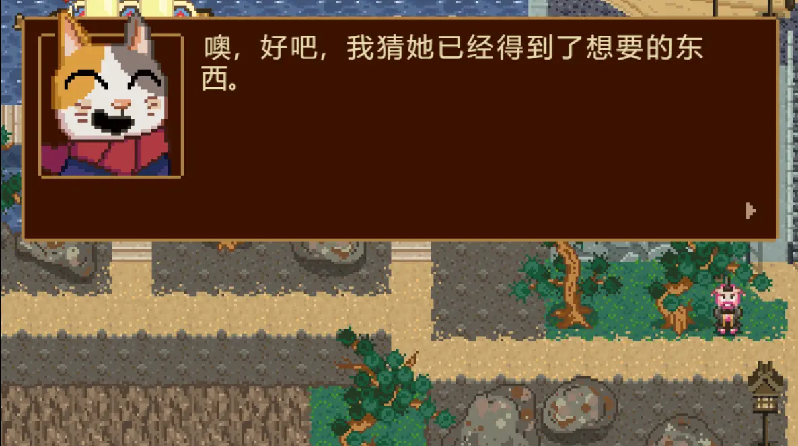

开幕式并没有看，然后看 v 站讨论知道这次的 Doodle 是 RPG 游戏形式就玩了下。。

<!--more-->

《欢迎来到 Doodle 冠军岛》

[https://www.google.com/logos/2020/kitsune/rc4/kitsune20.html?hl=zh-CN](https://www.google.com/logos/2020/kitsune/rc4/kitsune20.html?hl=zh-CN "《欢迎来到 Doodle 冠军岛》")

↑↑↑ 网址路径里还是 2020 /doge，然后「kitsune」好像是「妖狐」

主线就是岛上不同的妖怪种族或传说人物擅长各自的体育运动，然后作为主角的猫咪忍者要挑战他们。

项目有：射箭、花样游泳、滑板、登山（攀岩）、乒乓、橄榄球、马拉松。

其中，花泳对应「乙姬」（你本来就是生活在水里的吧喂），天狗擅长乒乓，鬼对应橄榄球（挑战时会与桃太郎组队）……对应射箭的洋一到是不知道是哪个故事人物。。

↑ 发现一个 Bug —— title 属性没有正确解析；

↑ 可以从四支队伍中选择一支加入，周边雕像是各项运行的上届冠军；

↑ 看到竹子想到辉夜姬，然而前边是天狗的地盘（乒乓球）；

↑ 每个队伍都有专属房间；

↑ emmm，表示竞技挑战很难的，我只想各处闲逛；

↑ 根本就是弹幕游戏吧，只是要主动接到而非躲开；

↑ 一个奖杯代表一个成就，我完成的都是支线任务；

↑ 支线任务有的会解锁一个更高难度的运动挑战；有的单纯让人感觉无语，比如帮鱼找回「幸运箭」后它已经忘记了这回事；还有的只是个很短的故事（毕竟是 Doodle 内的游戏），但是略有感慨，比如刺猬的故事；

你可以自己玩一下，如果只是好奇刺猬的故事，可以加 QQ 群听一下我的概况和讲解 —— 群号：189574683。

姑且也是有微信公众号的：「水水不想说」 ← 号如其名，并不会发什么文章。

虽然可能类似，却没能决然的做出和刺猬一样的选择。
