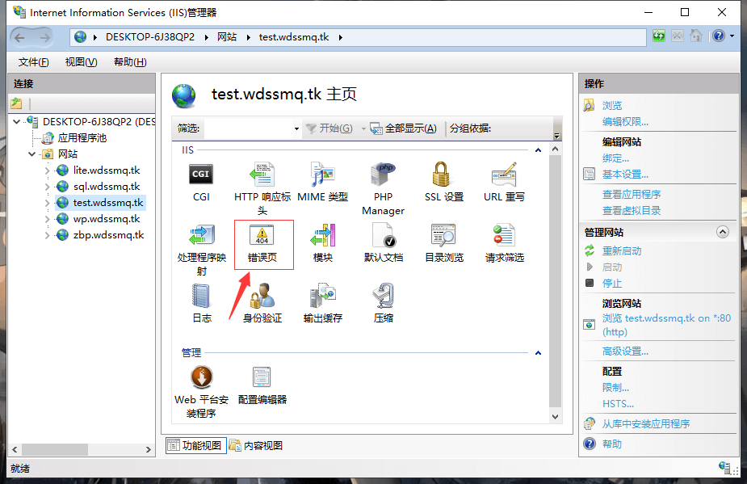
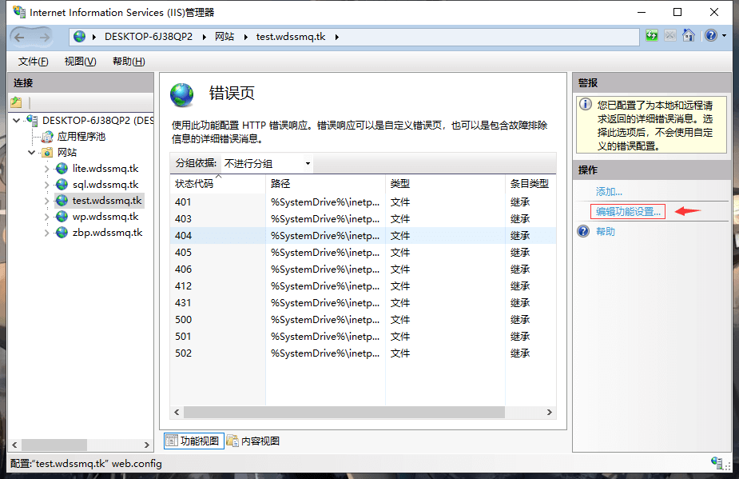
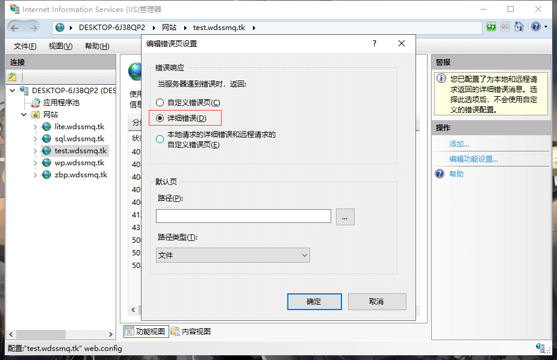

此文章日期：2021-12-06

不管是 Linux 还是 Windows，果然会用才是关键。。.jpg

<!--more-->

很久很久以前已经写过一篇：

> [【备忘】IIS7 显示具体错误提示\_电脑网络\_沉冰浮水](https://www.wdssmq.com/post/BeiWang-IIS7XianShiJuTiCuoWuTiShi.html "【备忘】IIS7 显示具体错误提示\_电脑网络\_沉冰浮水")
>
> ↑ 虽然并没有配图

使用 IIS 部署的站点在遇到 500 错误时默认并不会给出具体的错误排查信息，可通过「Internet Information Service(IIS)管理器」进行相应设置以开启「详细错误」选项；

<!--  -->

<!--  -->

<!--  -->

虽然马上就 2022 年了，对于 IIS 虚拟主机，可参考如下文章进行设置：

> [【备忘】web.config 配置 IIS 显示详细错误信息\_电脑网络\_沉冰浮水](https://www.wdssmq.com/post/20160901698.html "【备忘】web.config 配置 IIS 显示详细错误信息\_电脑网络\_沉冰浮水")

