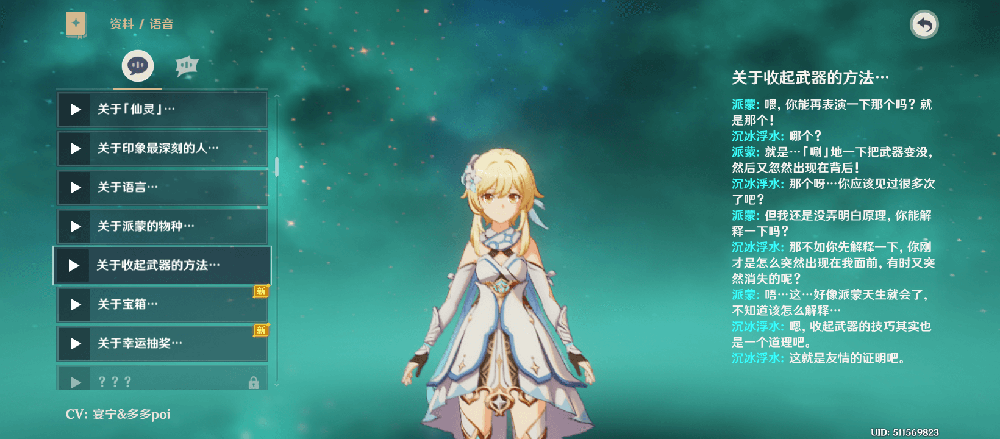
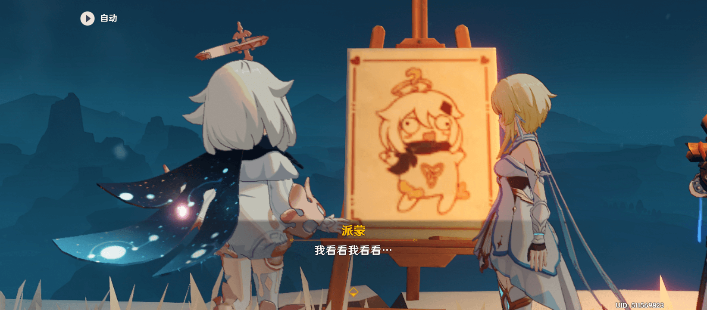
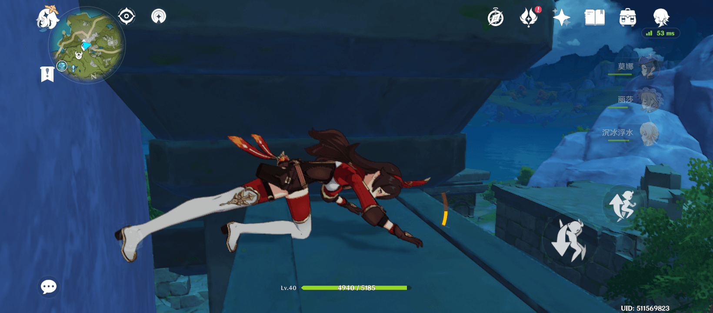

结果终于还是入坑「原神」了。。。

<!--more-->

**2021 年 12 月 25 日：**

这篇内容在 12 月 7 号就已经创建了，因为不知道怎么方便的外链图片之类的原因一直拖延，中间又正好经历了 jsDelivr 节点下线的事件。。

甚至现在已经进入稻妻剧情了。

然后是关于「一键拾取物品」，很早就发现时不时会在打开宝箱时触发「全部拾取」效果，后来专门留意了下，主要是在掉落物品比较多出现滚动条时比较多，但是判断区域比较不好把握，而且有滚动条的情况本身就比较少，最后发现直接「点击物品列表的左边」就好；

写这一部分前专门搜索了下，网上的表述都是「点击物品之外的界面」，然而右边界限不明显，上下界限明显，但是位置会不固定，只有左边最合适，虽然手指移动距离会长一些；

**原来的正文：**

前几天为了升级武器需要「混沌装置」，专门搜攻略记了几个会刷新「遗迹守卫」的地点，不够的话还可以进别人世界打。。

所以发现这游戏还有偷菜要素，时不时有人来收蒲公英什么的，果然也该留意下哪里有以便将来自己需要。。。

目前 0 氪，抽到一发 5 星——「莫娜」；

然后是「北斗」「雷泽」，然而雷元素有「丽莎」，双手剑有「诺艾尔」，「诺艾尔」倒是又抽到两发；

所以至少再来个风元素啊；

--------------

虽然想说，「冒险等级」卡 25 时先多探索下地图，能点的都点了再去过突破任务，然而突破后感觉打啥都刮痧，，，因为世界和怪物等级都提升了。。

「角色等级」突破又再一次变得遥遥无期。。

-------------

以下图片中的怪物标记均为「遗迹守卫」或「遗迹猎者」；

↑ 事实是游戏内怪物种类繁多，都靠地图标记并不现实，然后问过其他玩家后得知其实可以通过右上角「任务之书」→「讨伐」自动「追踪」指定类型的敌人；

↑ 所以虽然感觉这篇标记有些多余，但反正已经截好了图就发出来吧；

008 至 010 中则包含了几个可以采集「矿物」的地点，主要是「铁矿」或「白铁矿」；

↑ map-001

↑ map-002

↑ map-003

↑ map-004 —— 孤云阁这边要同时打 4 个机器人，只是刷素材并不建议

↑ map-008

↑ map-009

↑ map-010

---------------

--------
