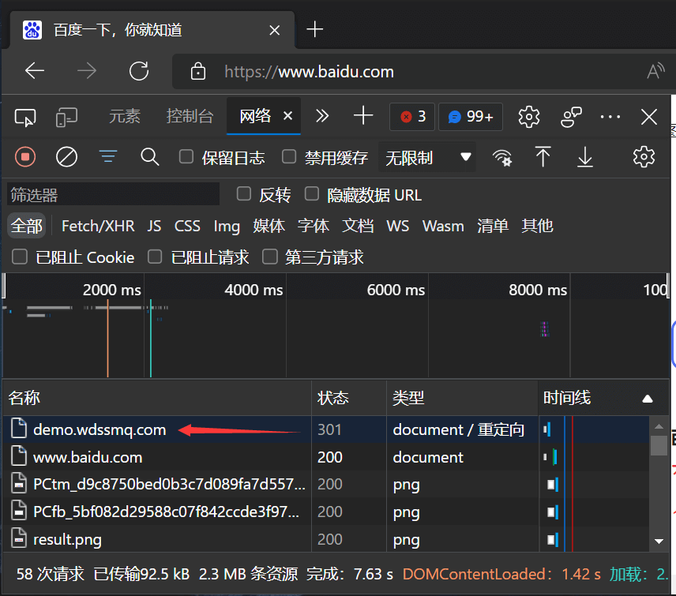

也是拖了略久的教程。。虽然可以水一篇但是内容又不是很多什么的。。

准备图片很麻烦，图床也很麻烦。。

<!--more-->

[「折腾」关于 2021 年末仍然没有完备的图床方案这件事\_电脑网络\_沉冰浮水](https://www.wdssmq.com/post/20211225085.html "「折腾」关于 2021 年末仍然没有完备的图床方案这件事\_电脑网络\_沉冰浮水")

--------

场景：

某个网址访问会被 301，服务器端已经取消或变更，浏览器因为缓存仍然会重定向到旧地址，又不想清理全部浏览器缓存；

1、

打开一个新的浏览器标签页，提前打开控制台；「快捷键 f12 或 ctrl + shift + i」


001.png ↑

2、

输入会跳转的链接并访问；


002.png ↑

3、

访问会被跳转，但是「控制台 → 网络」面板内会有原始访问的记录；



003.png ↑

4、

针对原始访问记录操作：「右键 → 清除浏览器缓存」；


004.png ↑

--------------

帮人写了下边规则，顺便贴出来：

```conf
# 单独针对首页 /index.php
if (-f $request_filename/index.php) {
    rewrite ^/index.php https://www.baidu.com/ permanent;
}

# 存在真实文件，但仍然跳转
if (-f $request_filename) {
    rewrite ^/((?!(zb_users|zb_system|sitemap)).*)$ https://www.baidu.com/$1 permanent;
}

# 当访问路径不是真实文件时
if (!-f $request_filename) {
    rewrite ^/((?!(zb_users|zb_system|sitemap)).*)$ https://www.baidu.com/$1 permanent;
    rewrite ^/sitemap/.+ /index.php;
}
```
