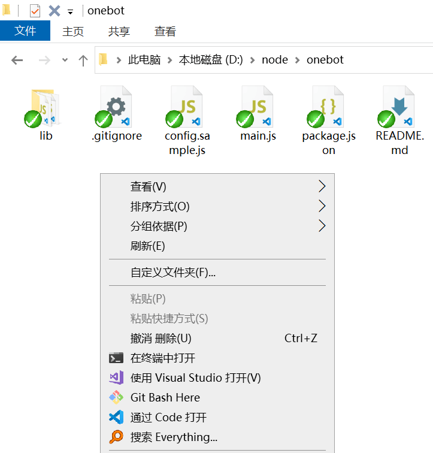
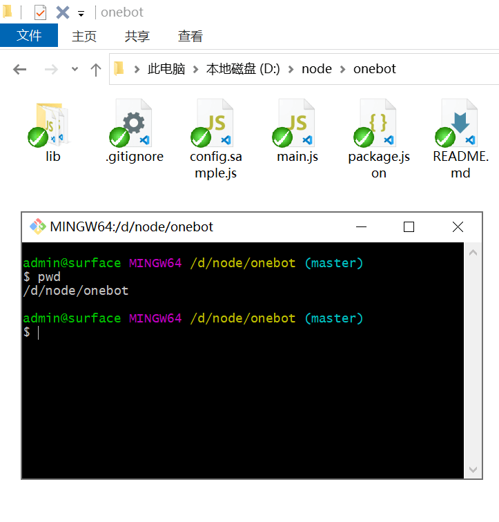
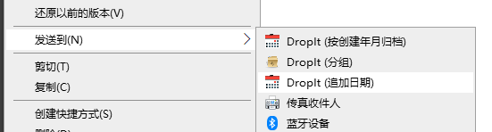
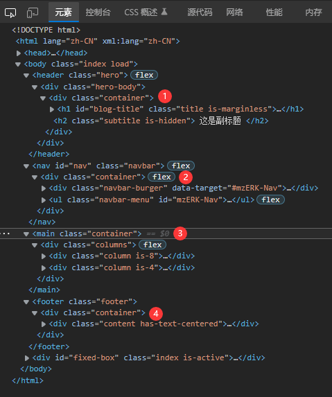

会为了表达一些准备而准备各种图片，，然而。。。

<!--more-->

### Git Bash

[【备忘】msysGit 安装及使用\_电脑网络\_沉冰浮水](https://www.wdssmq.com/post/20140804123.html "【备忘】msysGit 安装及使用\_电脑网络\_沉冰浮水")

Git for Windows 的安装教程里有标注过，Windows Explorer integration 一项中，「Git GUI Here」可以不要，然后要留着「Git Bash Here」；

可以方便的在需要的路径打开命令行，除了 git 自身相关的命令外，还可以在里边执行 node，实现写入、移动文件等操作；

虽然需要用 Linux 的命令语法；





### DropIt

[【折腾】使用 Quicker 拆分文件到子文件夹\_电脑网络\_沉冰浮水](https://www.wdssmq.com/post/20120827310.html "【折腾】使用 Quicker 拆分文件到子文件夹\_电脑网络\_沉冰浮水")

[使用 Quicker 实现「随机打开一个文件」](https://meta.appinn.net/t/topic/30933 "使用 Quicker 实现「随机打开一个文件」")

可用于向文件名中追加日期以便于区分之类的，虽然用 Quicker 也能实现类似的效果；



### HTML 布局中的 container

HTML 中会定义一个 `.container` 样式应用于相应元素，实现容器最大宽度及居中的效果；

```css
.container {
  margin-left: auto;
  margin-right: auto;
  width: 1000px;
}
```

然后，虽然可能 2022 年了，足够新的萌新仍然可能会选用略不科学的第一种写法；

```html
<body>
  <div class="container">
    <header> <!-- header --></header>
    <nav> <!-- nav --></nav>
    <main> <!-- main --></main>
    <footer> <!-- footer --></footer>
  </div>
</body>
```

下边写法中，`.container` 的父元素仍然会占满整个页面宽度，可以分别定义背景等样式；

```html
<body>
    <header>
        <div class="container"></div>
    </header>
    <nav>
        <div class="container"></div>
    </nav>
    <main>
        <div class="container"></div>
    </main>
    <footer>
        <div class="container"></div>
    </footer>
</body>
```


