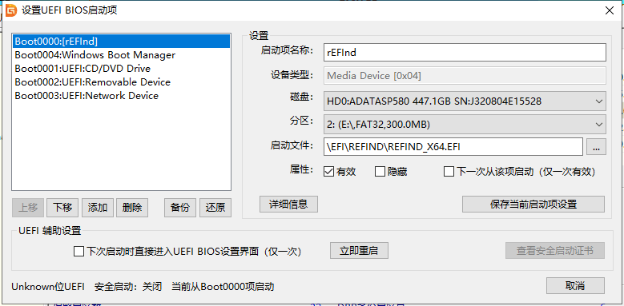

## 前言

之前给笔记本换了 SSD 硬盘，分了 60G 装了深度系统，果然仍然不够能用（这句话语法很别扭，然后深度系统给人的感觉就是这样）；

然后分了 C 盘把旧硬盘里的 Windows 系统复制进来，一通操作后深度系统的引导没了，一直想着怎么恢复回来；

以及，「ESP」和「EFI」这两个词各自是啥含义呢？

<!--more-->

## 一些前置链接

rEFInd 官方仓库：[https://sourceforge.net/p/refind/code/ci/master/tree/](https://sourceforge.net/p/refind/code/ci/master/tree/ "rEFInd 官方仓库")

rEFInd-theme：[https://github.com/topics/refind-theme](https://github.com/topics/refind-theme "rEFInd-theme")

rEFInd 引导使用教程 - 知乎：https://zhuanlan.zhihu.com/p/67114559

## 获取二进行文件

The rEFInd Boot Manager: Getting rEFInd：

[https://www.rodsbooks.com/refind/getting.html](https://www.rodsbooks.com/refind/getting.html "The rEFInd Boot Manager: Getting rEFInd")

↑ 在上边页面中「`A binary zip file`」指向链接下载到编译后的文件，解压后备用；

## Windows 下挂载 ESP 分区并设置访问权限

管理员权限打开 cmd 或 PowerShell 执行，`select disk 0`及`select par 3`为我当前的硬盘或分区序号；

```shell
# 进入工具
diskpart
# —— 进入后不再支持注释，所以后续请按行复制命令自身

# 列出磁盘

list disk

# 选择 efi 分区所在磁盘

select disk 0

# 列出分区

list par

# 选择 esp/efi 分区

select par 3

# 自动分配盘符

ass

# 获取权限（在 select par <serid> 选择分区后，需重启系统）

set id=EBD0A0A2-B9E5-4433-87C0-68B6B72699C7

# 恢复权限（在 select par <serid> 选择分区后）

set id=C12A7328-F81F-11D2-BA4B-00A0C93EC93B
```

## 放置 rEFInd 文件到 EFI 分区

复制下载文件中的「`refind`」文件夹到 EFI 分区内，`E`是前边`ass`命令分配到的盘符：

> `refind-bin-0.13.3.1\refind` → `E:\EFI\refind`；

复制或改名：

> `refind\refind.conf-sample` → `refind\refind.conf`；


## 添加至 UEFI 启动项

EasyUEFI 并不好用，然后发现`DiskGenius`也可以实现；

「- 前边取消隐藏的操作是不是也可以用这软件来 -」

1、「工具」→「设置 UEFI/BIOS 启动项」；

2、「添加」→「选择分区：EFI 所在分区）」→「启动文件：\EFI\refind\refind_x64.efi」；

3、左侧列表选中新添加的项→「启动项名称：`rEFInd`」→点击「保存当前启动项设置」→「上移」该启动项到第一位；

4、（可选）将「Windows Boot Manager」的属性勾选「隐藏」属性→「保存当前启动项设置」；





## 自定义配置及主题

```bash
# /e/EFI/deepin$
ls *.efi
fbx64.efi*  grub.efi*  grubx64.efi*  mmx64.efi*  shimx64.efi*
```

仅深度的引导目录内就有如上众多的 efi 文件，每一项都会被 rEFInd 识别会一个引导项；

别外还会直接扫描 Linux 内核来识别可引导项；

总之默认情况下会有各种重复的图标，需要自定义进行排除；

```conf
# 等待时间
timeout 0

# 不知道是啥
use_nvram false

# 关闭内核发现
scan_all_linux_kernels false

# 排除文件，对于 deepin 只保留 grubx64.efi
dont_scan_files grub.efi, fbx64.efi, mmx64.efi, shimx64.efi

# 上边的 dont_scan_files 并没有排除全部 efi 文件，会与下边的 menuentry 重复；

# 所以一般不需要使用 menuentry 指令定义项目，icon 也会自动匹配识别；

# menuentry "Deepin" {
# 	icon /EFI/refind/themes/rEFInd-minimal/icons/os_deepin.png
# 	loader /EFI/deepin/grubx64.efi
# }

# menuentry "Windows" {
# 	icon /EFI/refind/themes/rEFInd-minimal/icons/os_win.png
# 	loader /EFI/Microsoft/Boot/bootmgfw.efi
# }

include themes/rEFInd-minimal/theme.conf
```
