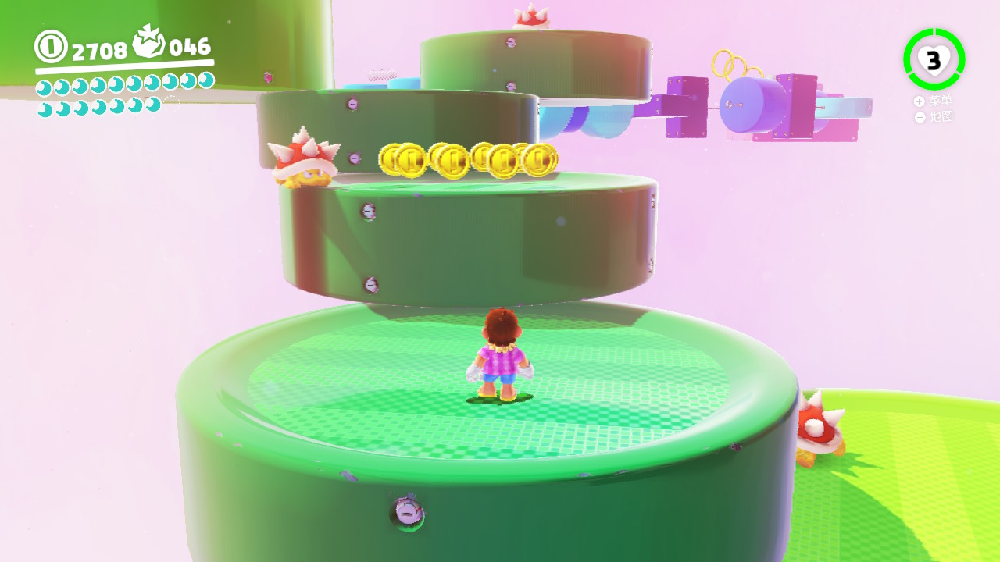

剪了个视频投 B 站，回来就不想写了。。

> 我失败了 100 多次，最后通关了这个游戏关卡，然而人生中的各种事件同样应对了一次又一次，却仍然为其所困扰……

<!--more-->

<iframe src="//player.bilibili.com/player.html?aid=865311043&bvid=BV1e54y1371P&cid=1034992654&page=1" scrolling="no" frameborder="no" framespacing="0" allowfullscreen="true"> </iframe>

-----

想起了之前的一个视频：[人生就是作茧自缚？动画短片《Accro》\_奇趣网文\_沉冰浮水](https://www.wdssmq.com/post/20100612513.html "人生就是作茧自缚？动画短片《Accro》\_奇趣网文\_沉冰浮水")

-----

探索过程中自己发现的收集或挑战基本上都完成了，有难度的至多试个 20 来次也就过了，只是这一关感觉恶意满满……

金币从 3500 掉到了 2700，死亡次数 100+ 肯定是有的，虽然终于还是完成了。。

「- 然后补截图和录屏又掉了 100 -」

滚动的机关桥本身是蛮普通的设计，然而数量 * 6，第二次上桥前的平台还有怪，时机就很难掌握……

之后是连续的 4 段，虽然可以选择不绕路从第 4 段直接跳到第 6 段……

帽子被没收了，怪是刺刺龟，不能踩，有刺刺龟的平台还是旋转的……

只是这些的话可能算不上恶意，但是这游戏有个抓墙的设计，跳得不够高时仍然可以抓住墙壁，然后再跳上去，然而这个过程中就会被怪攻击，加上平台在旋转，极大概率会被直接撞下去……

结果前期除了一次次熟悉旋转桥的过法，还要注意不要触发抓墙直接跳到相应的平台，一直以来主动或被动使用的技巧某种意义上被「惩罚」了……

一个原来「可以」的行为，突然被「惩罚」了，进而不得不一次次的努力避免……总之很糟糕又难以言述的体验增加了……

-----

↑ 较早之前一个试了很多次的收集点……

↑ 这个好像是解密类的，不知道怎么拿……
