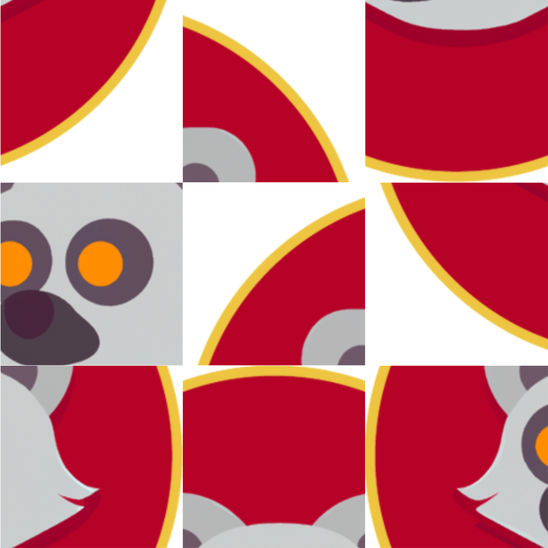
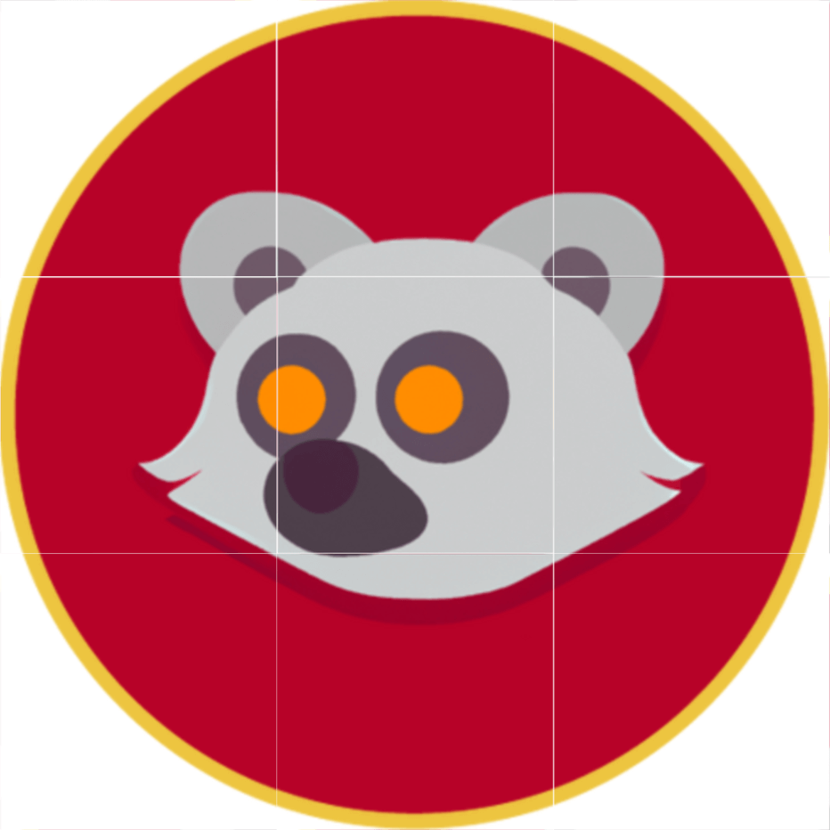
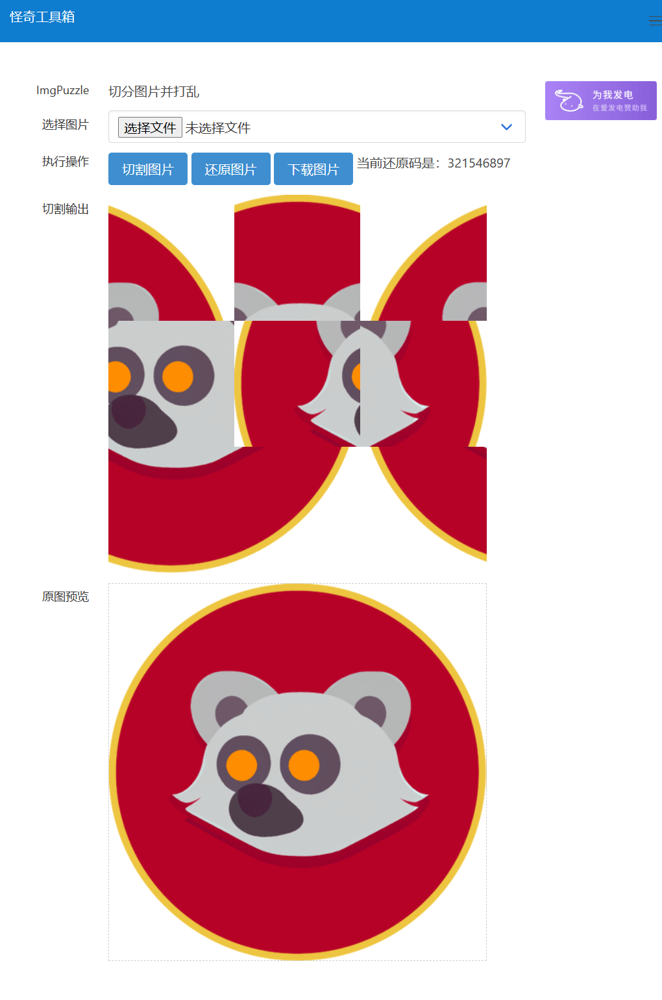

## 项目介绍

> 折腾，水一篇，周而复始……

图片切分成九宫格，打乱顺序后输出为一张图片，切分图作为输入可使用口令还原……

<!--more-->

## 项目地址

ImgPuzzle - 切分图片并打乱 - 水水的演示站：

[https://demo.wdssmq.com/tools/ImgPuzzle/](https://demo.wdssmq.com/tools/ImgPuzzle/ "ImgPuzzle - 切分图片并打乱 - 水水的演示站")

## 待办

- [ ] 原图非切分图的还原；

## 说明

实现思路：

`new FileReader()`对像可以读取文件，可以实现将读取到的图片数据设置为页面元素的 CSS 背景，因为需要获取图片的宽高信息，需要在额外用一下`new Image()`……

以下为读取部分的代码封装，实现预览的同时将图片数据存储在`ImgPuzzle.imgInfo`对象中，方便后续使用。

<!-- html 折叠 -->

<details>
<summary>点击这里查看代码；</summary>

```js
  // 图片预览封装
  const fnViewImg = ($input, $view) => {
    // 检查宽和高
    const checkWH = (w, h) => {
      if (w <= ImgPuzzle.imgInfo.maxWidth) {
        return { width: w, height: h };
      }
      const scale = ImgPuzzle.imgInfo.maxWidth / w;
      return { width: ImgPuzzle.imgInfo.maxWidth, height: h * scale };
    };
    const file = $input.files[0];
    // 检查文件是否为图像类型
    if (!/^image\//.test(file.type)) {
      ImgPuzzle._tips("err-type");
      return;
    }
    // 获取文件名
    ImgPuzzle.imgInfo.name = file.name;
    // 创建 FileReader 对象并读取文件数据
    const reader = new FileReader();
    // 读取成功后的回调函数
    reader.onloadend = function () {
      // 获取图像数据
      const img = new Image();
      img.onload = () => {
        // 获取图像宽高
        const { width, height } = checkWH(img.width, img.height);
        // 设置图像预览区域宽高
        $view.css("width", `${width}px`);
        $view.css("height", `${height}px`);
        ImgPuzzle.imgInfo.width = width;
        ImgPuzzle.imgInfo.height = height;
      };
      // 将图像数据赋值给 img.src
      img.src = ImgPuzzle.imgInfo.data = reader.result;
      // 将图像数据作为背景设置到 div 元素中进行预览
      $view.css("background-image", `url(${reader.result})`);
      $view.css("background-size", "cover");
      // 清空 input 文件选择框，以便用户可以选择同一张图片进行重新预览
      $input.value = "";
      ImgPuzzle.status.pickImg = true;
    };
    // 读取文件数据
    reader.readAsDataURL(file);
  };

```
</details>

切分时生成 9 个`div`并设置背景，使用 CSS 的`background-position`属性实现只显示部分图片，看起来就像是切割了一样。

每个`div`按顺序给以编号，打乱后按新顺序记录即可用以还原。

「- 每次都会有这种感觉，懂的肯定知道我表达的是啥，不懂的我这么表达真的有用么.jpg -」

总之详细的代码可以直接看源码。

## 项目截图

图像输出用的`html2canvas`这个库，输出的图片尺寸会比实现的元素大就不太理解，不知道有没有参数可以设置……

下边图片已经有自己缩放和压缩，然而比原图还是大了不少……



↑ 一张打乱的演示，还原码：`938517624`



↑ 还原后的效果


↑ 原图



↑ 网页截图
