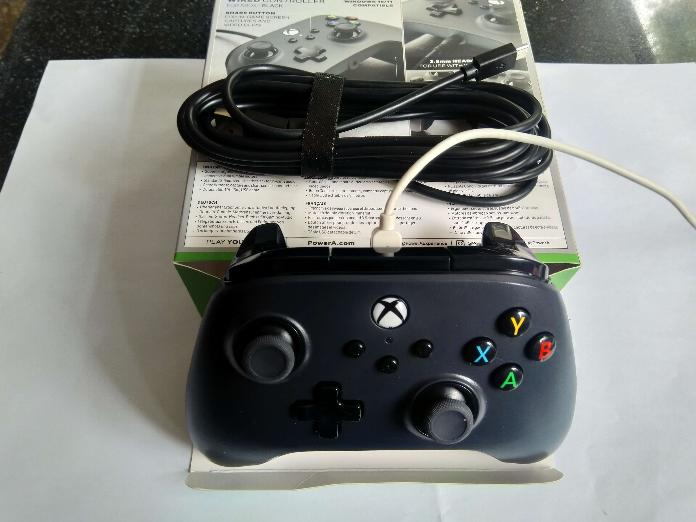
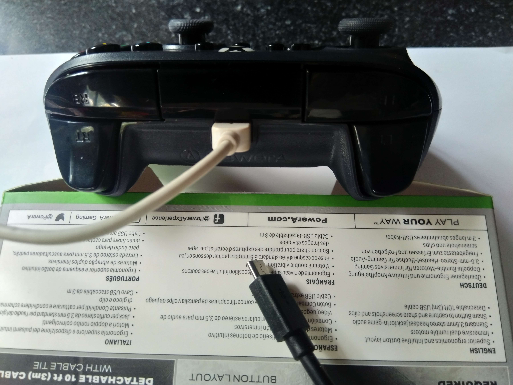

话说官方的拼写好像是仅有 X 大写？？

---------------------------------

2018 年 时曾买过两个 XBox One 手柄，微软天猫店，￥349 * 2；

<!--more-->

接电脑游戏用，然后，确实一些游戏更适合用手柄，虽然适合是一回事，想不想玩是另一回事……

- 《艾希》没通关；
- 《小小梦魇 2》没通关；
- 不太清楚是哪代的《刺客信条》没通关；
- 《胡闹厨房 2》也只玩了没多久；

通关的有：

- 《小小梦魇 1》
- 《Hob》
- 两部《三位一体》

总体上这两支手柄使用频度并不高，然而其中一个的 A 键回弹有些老化了，而且，没有额外接收器的话只能无线连接一个 - -；

----------------------

总之各种纠结下买了两支 PowerA 有线版，型号：LBX-1160A，￥178 * 2；

**然后，前一天下单，第二天收货，再然后发现被「满 300 减 50」的优惠背刺了。。。。**

手柄本身的话，按键手感就很微妙，右手区域的键按下引起的震动左手能很明显的感受到之类的。。。

然后在 Windows 下自动就查以当鼠标用，但是键位映射……

- LT 是鼠标右键；
- RT 是鼠标左键；
- LB 是 ctrl；
- RB 是 shift；
- A 是回车；
- B 是空格；
- X 是 PgUp；
- Y 是 PgDn；
- R 摇杆是鼠标移动；
- L 摇杆是方向键；
- 方向键也是方向键；
- R 摇杆按下好像没功能；
- L 摇杆按下会呼出屏幕键盘，虽然那键盘还蛮好看的；；；

其实也是打算配合「Controller Companion」当鼠标用的，但是操作有冲突，结果是手柄驱动自带了，带是带了，这键位什么鬼。。。

然后作为兼容手柄，就不清楚这功能是厂家自己塞的，是微软的逆天设计，，关键是没找到修改的地方。。。

微软应用商店有一个「Xbox Accessories」可以配置手柄，但是看了下并没有设置**键鼠**映射的地方，然后这个软件也中各种转圈加载中。。

