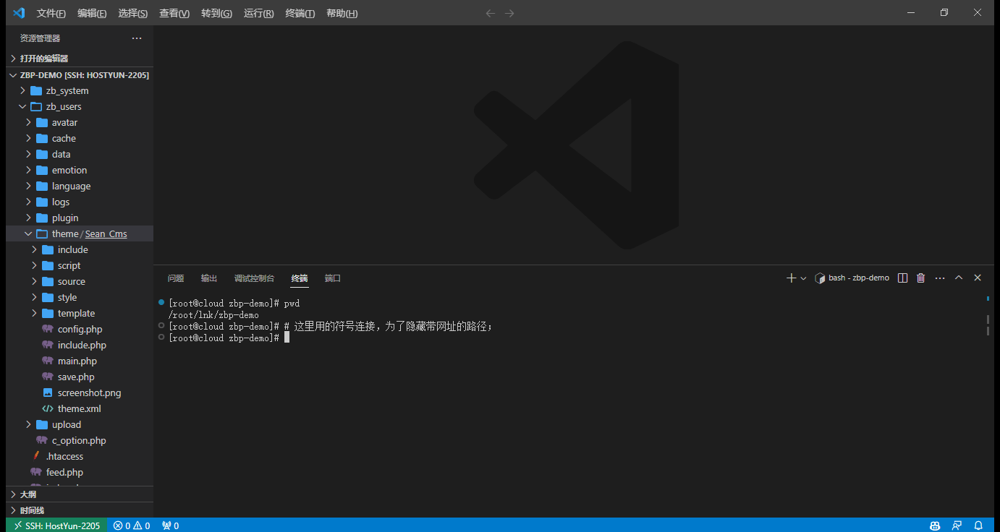
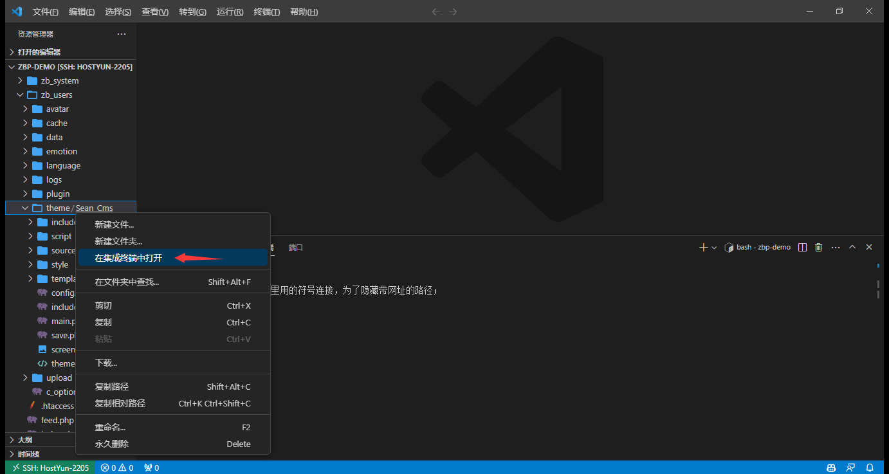
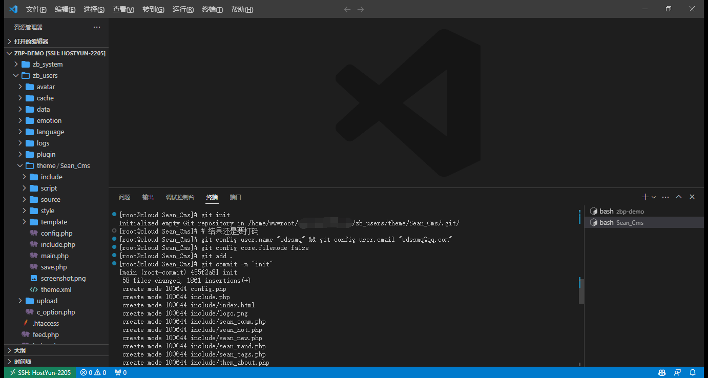
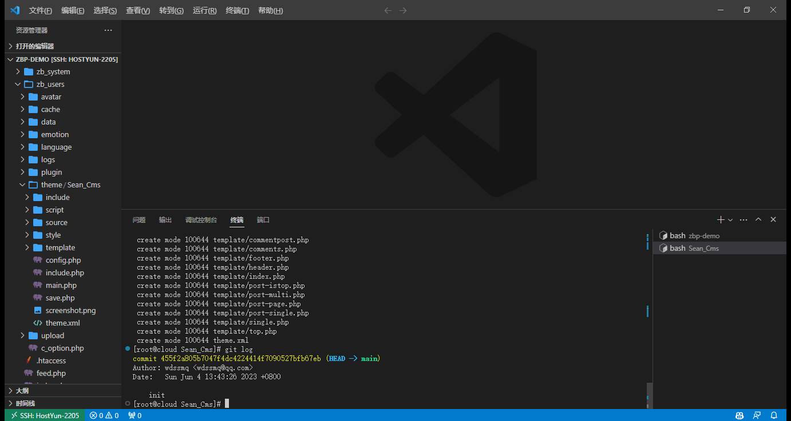
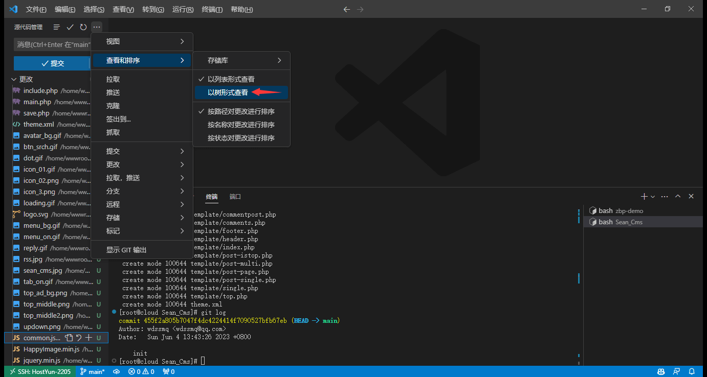
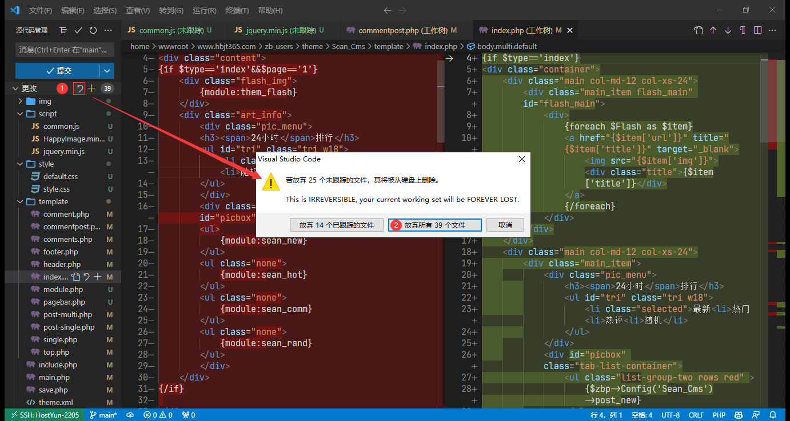

## 前置

感觉这个技能对于普通用户来说有点难了，嘛，反正这个系列教程的主题是「水坑」；

<!--more-->

有一个 Z-BlogPHP 站点用了「Sean_Cms」这个主题，之前很久没更新，2023-04-17 突然更新了，然后不确定我自己有没有修改过，需要 Git 对比下；

借助 Git，你可以将自己对主题或某个插件的插件与作者的后续更新内容进行合并，不会因为更新而丢失自己的修改，或者只能选择放弃更新；

这里并不教怎么安装 Git 啥的，基本上只是核心操作的演示；

更多内容可以看这个链接：[tag/Git/](https://www.wdssmq.com/tag/Git/ "Git\_沉冰浮水")；

## 主要操作

- VSCode 内打开你的站点或主题目录；
- 命令行进入主题或者插件目录；「VSCode 可以直接鼠标操作」
- 执行下边命令，用户和邮箱可以自己修改；


```bash
git init # 初始化 Git 仓库；
git config user.name "wdssmq" && git config user.email "wdssmq@qq.com" # 设置用户名和邮箱；
git config core.filemode false # 关闭 filemode，防止文件权限变化导致的文件变化；
git add . # 添加所有文件到暂存区；
git commit -m "init" # 提交到本地仓库；
git log # 查看提交记录；

```









- 升级主题或者插件；


- 回到 VSCode，快捷键：`Ctrl + Shift + G` 切换到 Git 管理；
- 这里每个新环境都要改下列表视图就很麻烦；
- 然后其实，，，这种重构级别的更新，，好像并不适合作为本教程的例子，因为改动太多了「- -」；
- 可以通过「放弃所有更改」恢复到更新前的状态；




