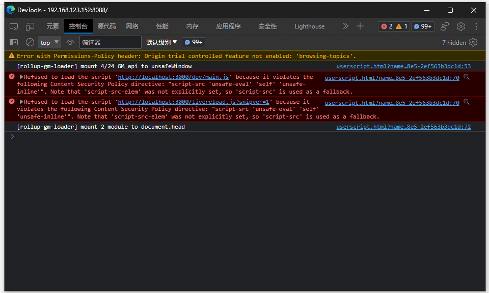
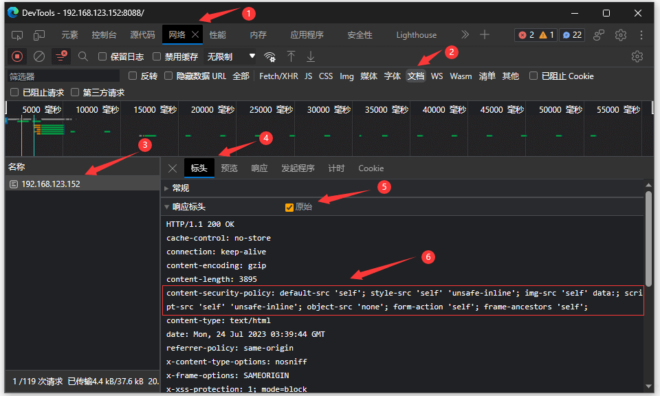
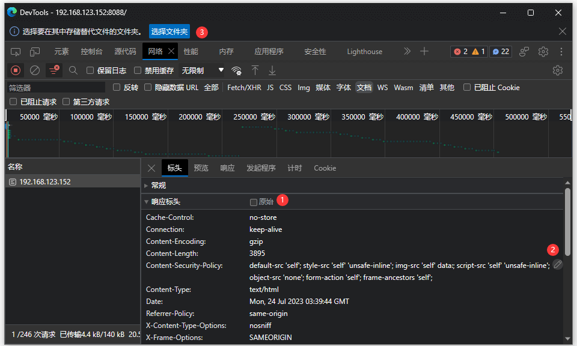
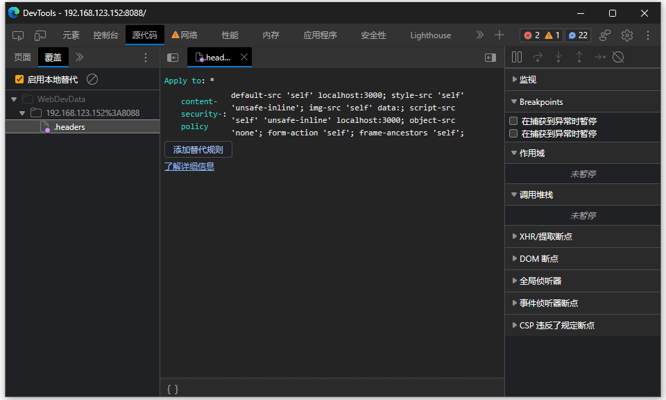

### 简要

有给各种网页写「GM_脚本」，姑且有弄「热重载」机制方便开发，但是一些网页的 CSP 策略不允许引入外部脚本，浏览器里也有临时禁用 CSP 的插件，但是并不总是管用，今天发现了一种浏览器自带的方法可以修改网站的「响应标头」，可以绕过网页自身的 CSP 限制；

<!--more-->

### 正文

**· 例行贴一些「相关」链接：**

1. [「折腾」使用 rollup.js 模块化编写 GM 脚本\_电脑网络\_沉冰浮水](https://www.wdssmq.com/post/20120627834.html "「折腾」使用 rollup.js 模块化编写 GM 脚本\_电脑网络\_沉冰浮水")
1. [「言说」写了份有点「大」的代码\_杂七杂八\_沉冰浮水](https://www.wdssmq.com/post/20190704011.html "「言说」写了份有点「大」的代码\_杂七杂八\_沉冰浮水")
1. [「GM\_脚本」qBittorrent 批量修改种子 tracker\_电脑网络\_沉冰浮水](https://www.wdssmq.com/post/20191117777.html "「GM\_脚本」qBittorrent 批量修改种子 tracker\_电脑网络\_沉冰浮水")

所以就是在更新「qBittorrent 批量替换 Tracker」时再一次感受到不能直接引入外部脚本的痛苦，然后发现浏览器是直接提供了修改支持的；

> qBit 自身也是支持追加响应头的，新添加的理论上是会覆盖旧的，不知道姿势不对还是什么原因没走通；

**· 需要添加的字段：**

对于 `wdssmq/rollup-plugin-monkey`，需要为 `Content-Security-Policy` 补充相应规则：

- `default-src 'self' 'unsafe-inline' https://* data:;`
- `connect-src ws://localhost:3000;`
- `script-src 'unsafe-inline' https://* http://localhost:3000;`

注：具体要与原始值合并，原则上应该是在原值基础上添加 `ws://localhost:3000` 和 `http://localhost:3000`；

**· 操作步骤：**

CSP 报错示意（001.png）；

↑ 001.png

查看并复制原始 CSP 响应标头（002.png）；

↑ 002.png

指定一个本地空白文件夹用于存储「替代文件」（003.png）；

注：选定文件夹后有一个请求读写权限的确认选项；

↑ 003.png

添加「替代规则」，具体值以实际需要为准（004.png）

↑ 004.png

### 结束

- CSP 全称为「Content Security Policy」，中文名为「内容安全策略」，是一种用于检测并减轻 XSS 攻击的浏览器安全机制，其实就是一种「白名单」机制，只允许指定的资源被加载；
- 修改后的值按实际需要，也不限于这个标头字段；
- AI 有给一个直接从浏览器配置中禁用 CSP 的方式，因为是针对全部网站的，所以不推荐使用；
  - 在浏览器地址栏输入 `about:config` 并回车，搜索 `security.csp.enable` 并双击修改为 `false`）；
  - 实际效果其实也没试；

