## 一

虽然想着尽量横屏拍照片，但总是忘记；

然后一直白嫖 TinyPNG 来压缩图片，之前大部分都是 PNG 的截图，JPG 的照片就容易超过 5MB 的限制，所以先用了另外的一个软件；

<!--more-->

> Jpg-C 图像批量修整压缩剪裁调整大小工具
>
> [https://zzy.my/blog/post/Jpg-C](https://zzy.my/blog/post/Jpg-C "Jpg-C 图像批量修整压缩剪裁调整大小工具")

这次有 4 张超了，其中一理实际是横屏拍的，但是重力感应好像没转过来，整理时直接用看图软件旋转了下，6.98MB 就变成了 2.20MB 就不太懂发生了什么；

看图软件用的 JPEGView，然后写到这里发现有装 FSViewer，好像整理图片会更方便些……

## 二

简单说就是有一只五金工具箱，里边的东西塞进了另一个大一点的工具箱里，然后夏天出门时两部手机不好携带，就装工具箱里拎着；

其实 2021 年就在用了，当时副手机的那台魅族已经出掉了，再然后去年（2022）被大橘压坏了一个卡扣，现在又一个夏天过去，身上的口袋也多了……

姑且放个打钱链接为大橘赚点猫粮：

> 沉冰浮水正在创作和 Z-BlogPHP 相关或无关的各种有用或没用的代码 | 爱发电
>
> [https://afdian.com/a/wdssmq](https://afdian.com/a/wdssmq "沉冰浮水正在创作和 Z-BlogPHP 相关或无关的各种有用或没用的代码 | 爱发电")

## 三

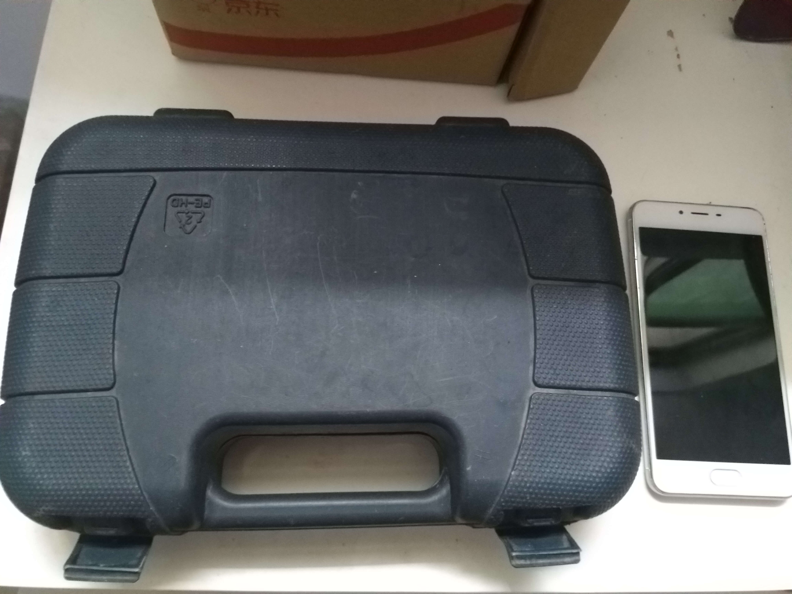

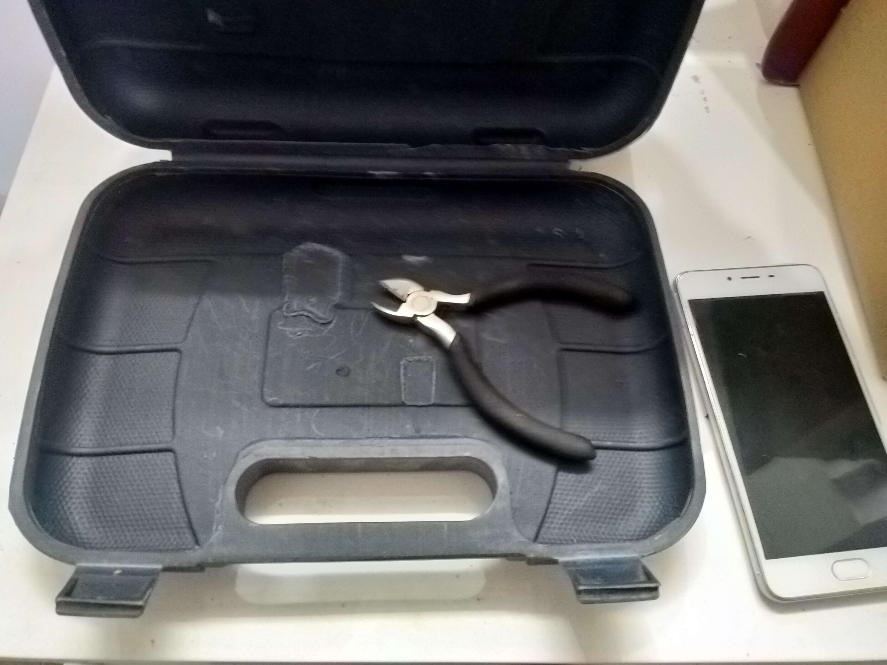

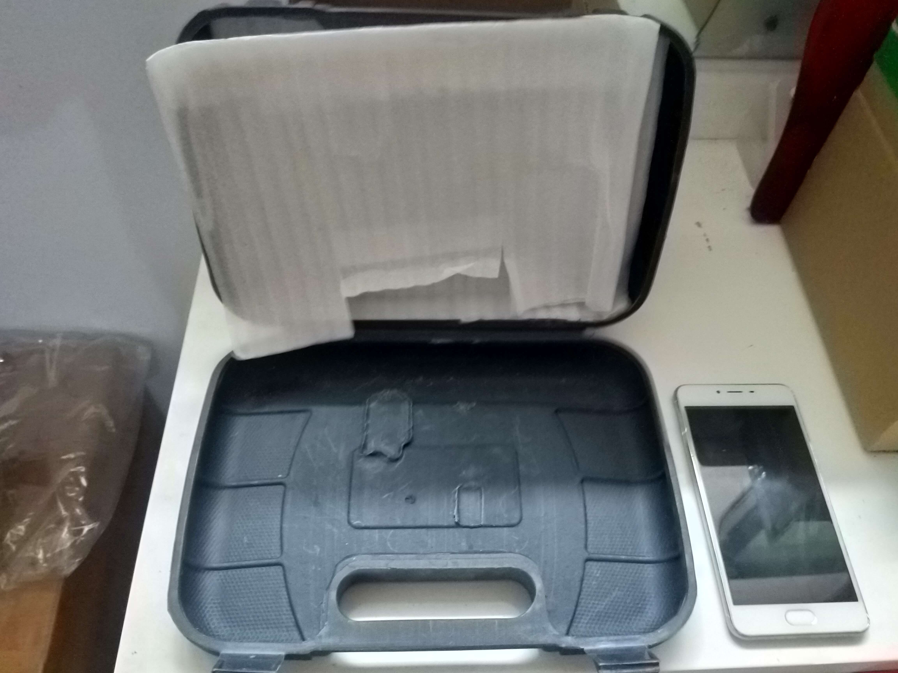

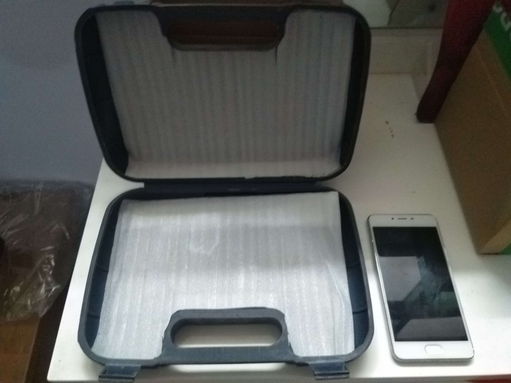

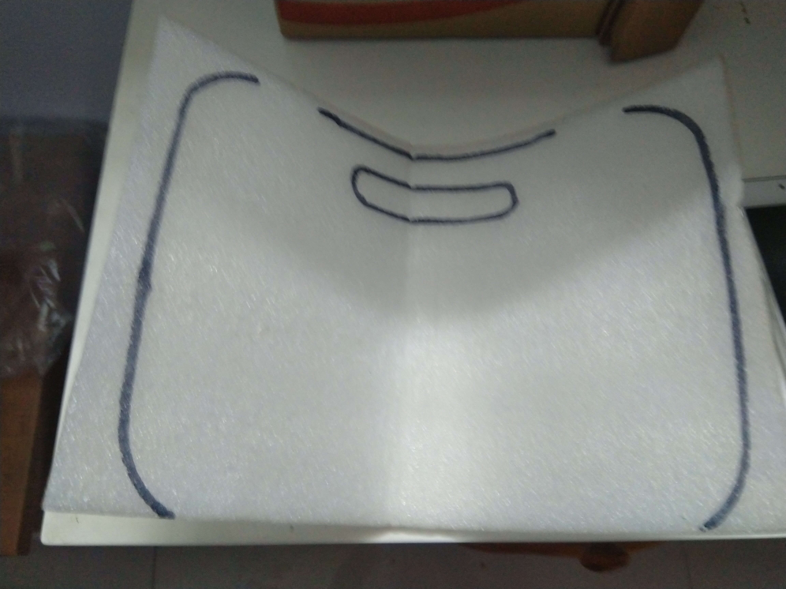

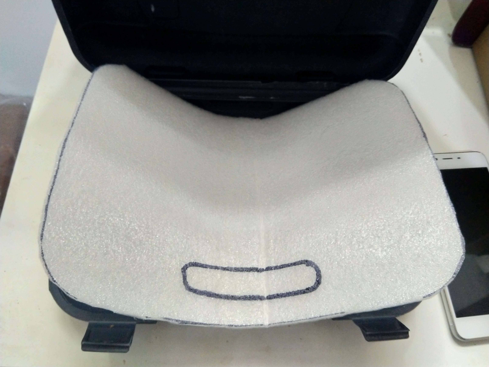

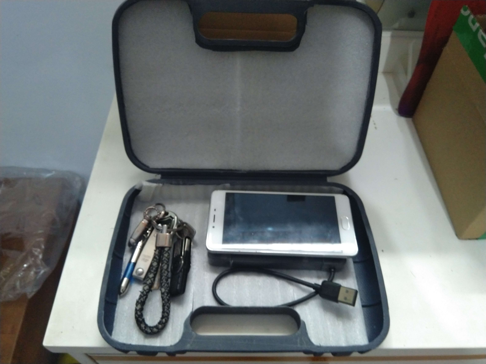

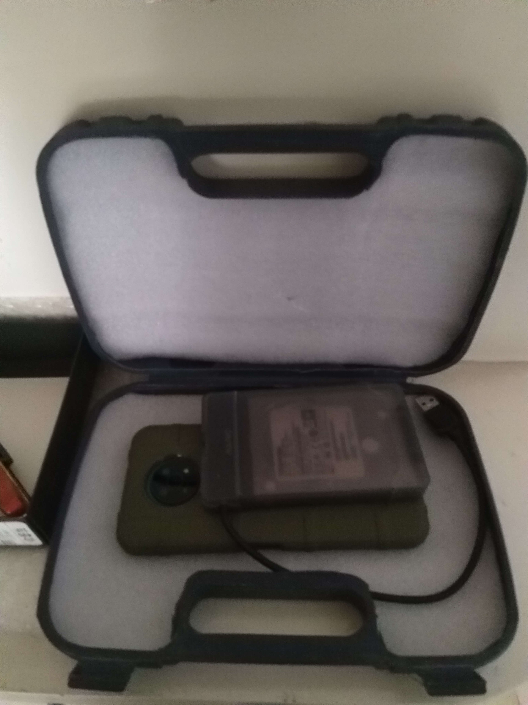

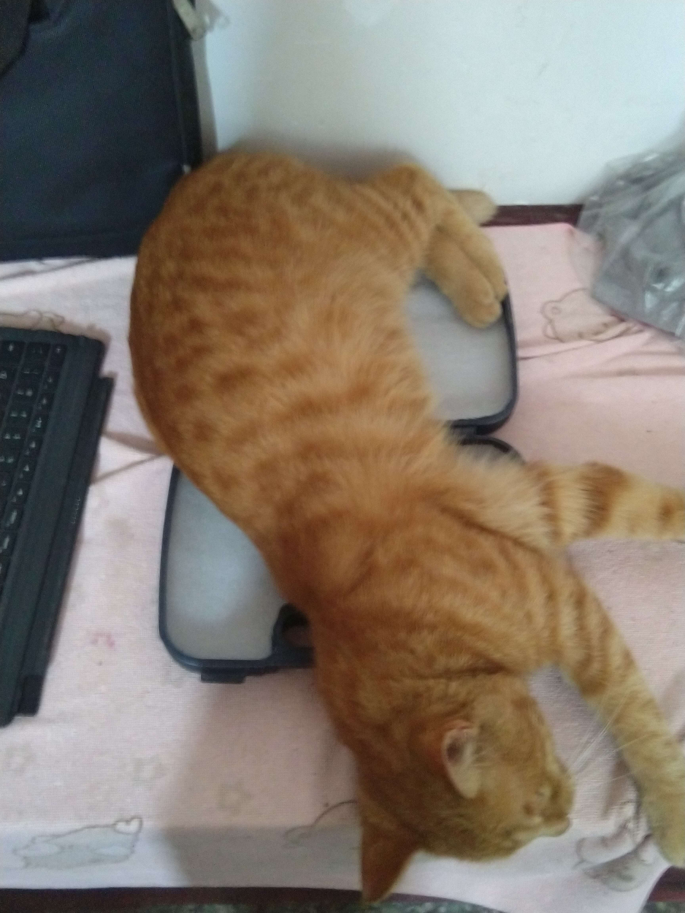

<!--  -->

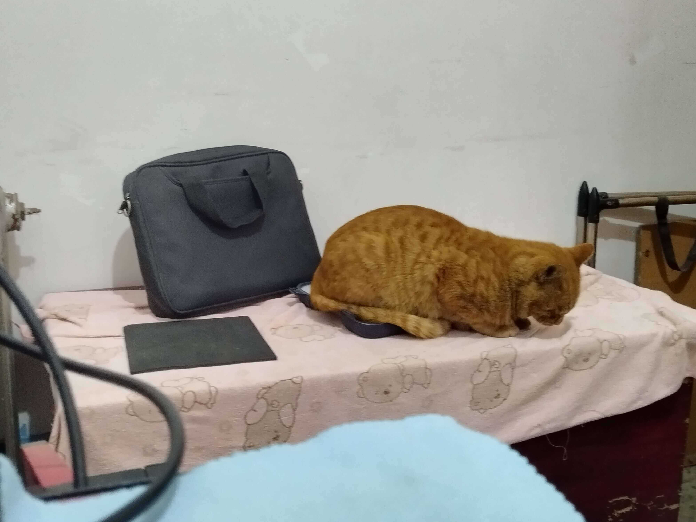

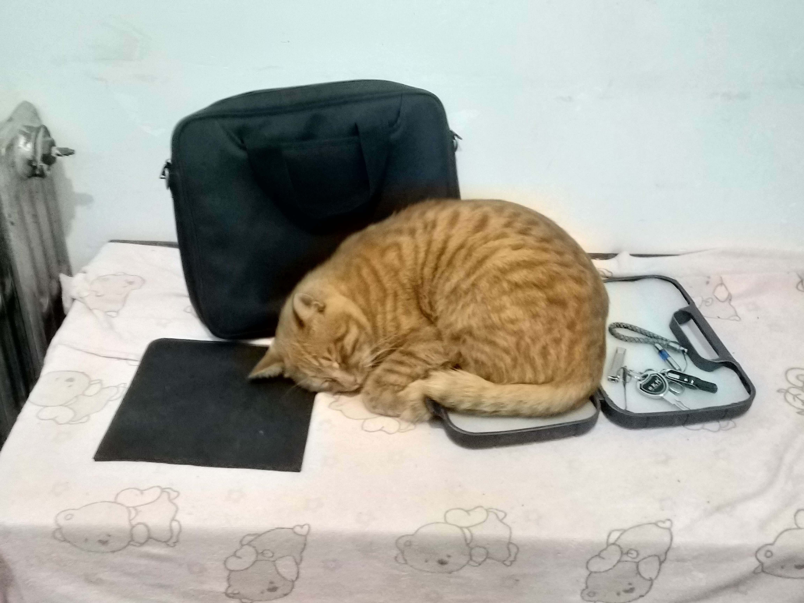

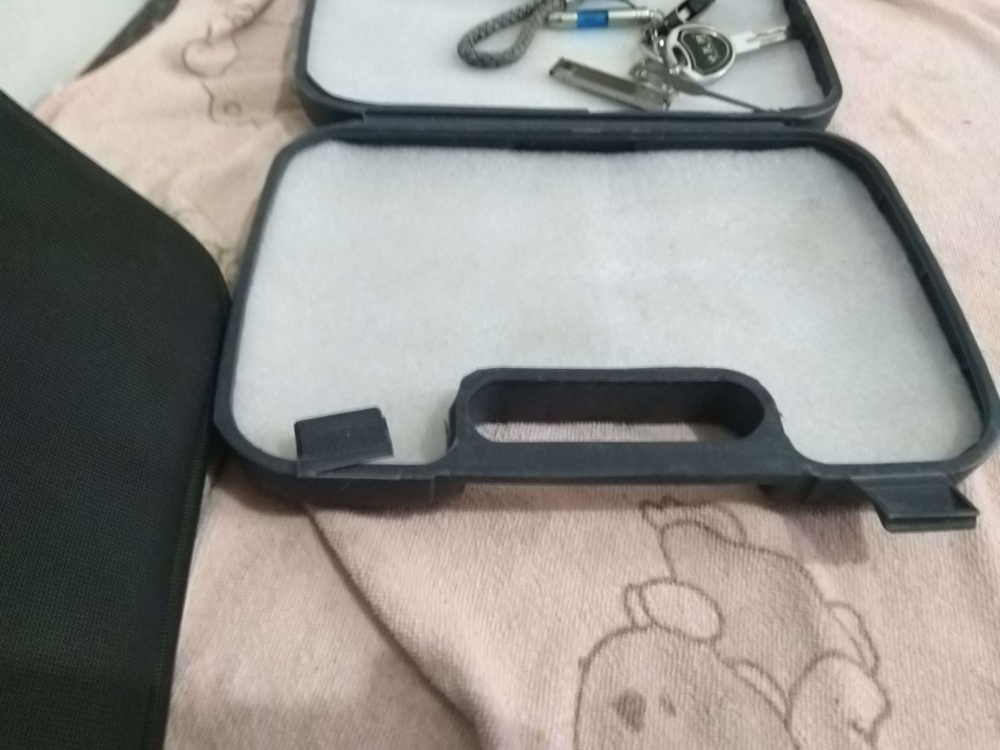
