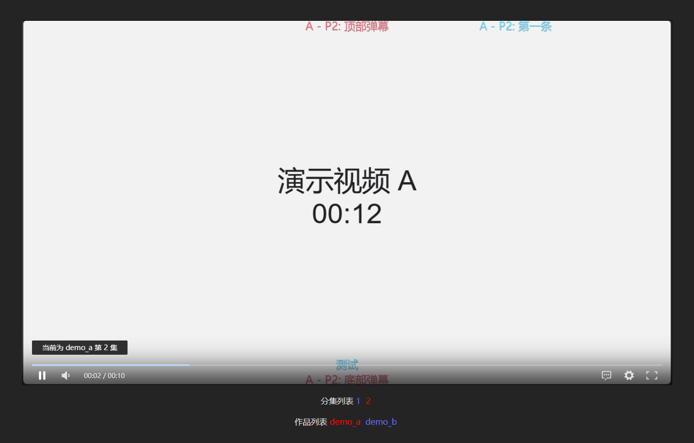
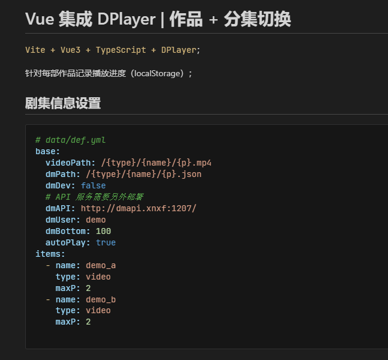

正式接触 Vue.js 也两年多了，实际写过的项目好像也就 4 个？「基于 Vite」

<!-- 2021-07-08 -->

另外还试过 mpvue 和 taro 写小程序 —— 同样的功能需求，用两个框架加 Vue 分别实现了一遍；

<!--more-->

最早写作为 Z-BlogPHP 主题的 [vite_zbp_vue_TestType](https://gitee.com/wdssmq/vite_zbp_vue_TestType "基于 Z-BlogPHP API 的博客主题；Vue 3 + Vite；") 项目时，使用了 Vuex 管理状态，后来官方推荐换 Pinia，然而一直懒得更新，实际上两者具体使用上的区别也还没了解清楚；再然后，以这个项目来说，可能不用专门的状态管理大概也可以？

> 用响应式 API 做简单状态管理 | Vue.js
>
> [https://cn.vuejs.org/guide/scaling-up/state-management.html#simple-state-management-with-reactivity-api](https://cn.vuejs.org/guide/scaling-up/state-management.html#simple-state-management-with-reactivity-api "用响应式 API 做简单状态管理 | Vue.js")

然后目前的第四个项目是一个集成 DPlayer 的在线视频播放器，作品 + 分集切换的实现就需要用到状态管理，算是一个很恰当的实践；

下边是实现思路的讲解 ——

· 封装一个 store 对象用于全局状态管理；

· 对于状态属性的读写，以及和 localStorage 的交互，封装为相应方法；

```ts
// store.ts

// 引入响应式 API 和 localStorage 的封装
import { reactive } from 'vue'
import { useStorage } from '@vueuse/core'

// 省略了一些类型定义和具体方法的实现

const lsStore = useStorage('lsStore', { lst_work: 0 } as TypeLsStore)

export const store = reactive({
  // 当前剧集信息
  work_id: 0,
  work_name: '',
  work_ep: 1,
  work_ep_time: 0,
  work_ep_max: 0,
  // 剧集列表
  work_list: [] as TypeData['items'],
  // 初始化
  init: (list: TypeData['items']) => {
    // 写入剧集列表
    store.work_list = list
    // 切换到上次播放的作品
    store.changeWork(lsStore.value.lst_work)
  },
  // 作品切换
  changeWork: (id: number) => {
  },
  // 剧集切换
  changeEp: (ep: number) => {
  },
  // 判断并读取上次播放记录，第几集的第几秒
  getProg: () => {
  },
  // 写入播放记录
  setProg: () => {
    lsStore.value[store.work_id] = {
      lst_ep: store.work_ep,
      lst_ep_time: store.work_ep_time,
    }
  },
})

```

· 只有一个 App.vue 页面，所以不需要路由；

```html
<script setup lang="ts">
// 引入 API 和状态管理对象
import { computed } from 'vue'
import { store } from './base/store'

// 其他组件、数据处理等
// ...

// 初始化状态
store.init(data.items)

// 分页切换后，将新的“页码”更新到 store
function pageChange(type: string, page: number) {
  if (type === 'ep') {
    store.changeEp(page)
  } else if (type === 'works') {
    store.changeWork(page - 1)
  }
}

// ↑ 分页组件内绑定点击事件，向上传递给父组件内监听函数，更新 store 状态后把切换效果渲染回分页组件；
// ↑ 这里可以在分页组件内直接更新 store 状态，切换函数放在分页组件自身，具体取舍看实际需要；
// dplayer 组件内有自动续播及时间进度记录之类的，所以就选择了直接更新 store 状态；

// 作品分页信息
const worksPageInfo = computed(() => {
  return {
    name: '作品列表',
    type: 'works',
    page: store.work_id + 1,
    items: store.work_list,
  }
})

// 分集翻页信息
const epPageInfo = computed(() => {
  return {
    name: '分集列表',
    page: store.work_ep,
    type: 'ep',
    total: store.work_list[store.work_id].maxP,
  }
})

// 当「状态」变化时，会重新获取视频数据，以及上边的分页信息
const dplayerInfo = computed(() => {
  return buildDplayerInfo(data as TypeData, store.work_id, store.work_ep)
})

</script>

<!-- ↓↓ computed 封装的数据更新时，会触发相应的组件重新渲染 ↓↓ -->

<template>
  <!-- 视频播放器调用 -->
  <dplayer :dplayerInfo="dplayerInfo"></dplayer>
  <!-- 分集翻页 -->
  <pagebar :pageInfo="epPageInfo"
           @page-change="pageChange"></pagebar>
  <!-- 作品列表分页 -->
  <pagebar :pageInfo="worksPageInfo"
           @page-change="pageChange"></pagebar>
</template>

```

「- -」「- -」「- -」「- -」「- -」「- -」「- -」「- -」

然后这个 Vue DPlayer 项目写在了私有 Git 里，有兴趣的加 QQ 群下载吧……

· 各种 QQ 群

> **咸鱼自习室: `576621997`**
>
> **我的咸鱼心: `189574683`**

· 作品信息

> ### Vue 集成 DPlayer | 作品 + 分集切换
>
> `Vite + Vue3 + TypeScript + DPlayer`；
>
> 针对每部作品记录播放进度（localStorage）；

· 附图




