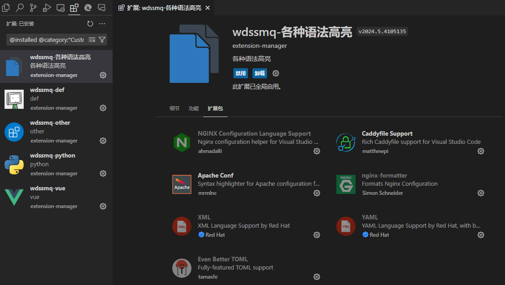

浏览器用的 Edge，有一个「扩展管理器」可以对扩展进行分组管理，很方便；

VSCode 也装了一堆扩展，数量上更多，就搜索了下有没有同功能定位的东西，姑且也是有的 —— `zyg.extension-pack-manager2`；

<!--more-->

后边会简单介绍和给出链接；

------

首先是浏览器下的「扩展管理器」，下边是在 Edge / Chrome 上的链接：

> Chrome: [扩展管理器（Extension Manager）](https://chromewebstore.google.com/detail/gjldcdngmdknpinoemndlidpcabkggco "扩展管理器（Extension Manager）- Chrome")
>
> Edge：[扩展管理器（Extension Manager）](https://microsoftedge.microsoft.com/addons/detail/bhahgfgngfghgjhnpplmemebhenieijb "扩展管理器（Extension Manager）- Edge")

核心功能如下：

1. 可以按需对扩展进行分组以实现快速切换启用；
2. 对于需要一直开启的，可以将其添加在「固定分组」里；
3. 切换分组时，「目标分组」和「固定分组」的扩展会取**并集**启用，不在这两个分组里的则默认禁用；
4. 仍然可以临时启用或禁用某个扩展，下次切换分组时会恢复到分组里的状态；

其他还可以按匹配站点启用什么的，算是锦上添花了，目前核心功能对我来说已经够用了。

-----

对于 VSCode，你可以通过搜索 `zyg.extension-pack-manager2` 或者直接访问下边的链接：

> Extension Manager - Visual Studio Marketplace
>
> [https://marketplace.visualstudio.com/items?itemName=zyg.extension-pack-manager2](https://marketplace.visualstudio.com/items?itemName=zyg.extension-pack-manager2 "Extension Manager - Visual Studio Marketplace")

↑ 这个已经是修改版了，原版好像不能用了一直没更新，然后修改版的 git 库也没了。。

然后功能上也略简单，分组后只能一键启用/禁用分组自身包含的扩展。。。

使用方法：`Shift + Ctrl + P` 打开命令面板，输入 `扩展`，可以找到以下两个命令项：

- 扩展: 创建自定义扩展包
- 扩展: 查看自定扩展包

↑ 文本用词还不统一 -_-!

- 创建时可以设置名称，描述，图标，然后勾选需要包含的扩展；
- 使用「查看」命令列出所有自定义的扩展包，一键启用/禁用；
    - __在每个「扩展包」的「管理」菜单__（下图左侧列表内的齿轮）内可以找到「编辑扩展包」的选项；

**重要：直接卸载自定义的「扩展包」会连带包含的扩展一起卸载，如果只是想「删除分组」，请使用「编辑扩展包」界面内的「卸载」按钮；**

然后姑且录了个视频，点击链接进入 B 站观看：[「折腾」VSCode 扩展分组管理\_哔哩哔哩\_bilibili](https://www.bilibili.com/video/BV1QMETeDEc7/ "「折腾」VSCode 扩展分组管理\_哔哩哔哩\_bilibili")

<iframe src="//player.bilibili.com/player.html?aid=112380450702080&bvid=BV1QMETeDEc7&cid=500001530258651&p=1" scrolling="no" border="0" frameborder="no" framespacing="0" allowfullscreen="true"> </iframe>
