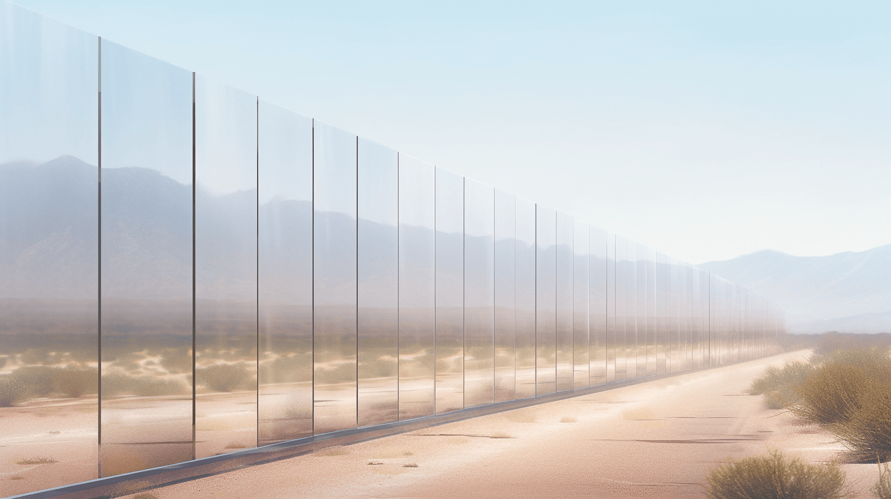

三月份的时候尝试把略久的一个意像用文生图工具展示出来，甚至忘记用的哪个在线服务了。。

<!--more-->

反复试了各种表述再翻译成英文，最后直接跟 gpt 说我要用来生成图像，被简略成了几个关键词，姑且得到一张略有感觉的图，虽然要素条件仍然不满足，物理上难以翻越的感觉也没有达到。。

> Resilio Sync 丨 各种图片
>
> BDEHQ6UVPVUMAOV6HEVBKCRUQPWNTAPUZ

· · · · · ·

一条虚空中的路，看不到起点与终点，它的隔离带是玻璃的，分割成左右两部分的那种隔离带(median)，和路一样长，玻璃的高度是路宽度的两倍，路两边是黑暗，路以外的地方没有任何东西，远方也没有背景元素。采用非现实画风；

· · · · · ·

一条看不到起点与终点的路，隔离带（median strip）是玻璃的，玻璃有一定的厚度，和路一样长，玻璃的高度是路宽度的两倍，没有缺口让两边互通；

路两边是黑暗，路以外的地方没有任何东西，远方也没有背景元素；

· · · · · ·

完全由玻璃构成的，将公路分隔成上下行的隔离带（median strip），隔离带自身只由玻璃构成，有一部分是深埋于地下的，地上部分也严丝合缝，高到几乎无法翻越；

路与隔离带都看不到起点与终点，路两边是荒漠，没有车，房子，山，树，也没有人工植被和农作物，远方也没有背景元素；
