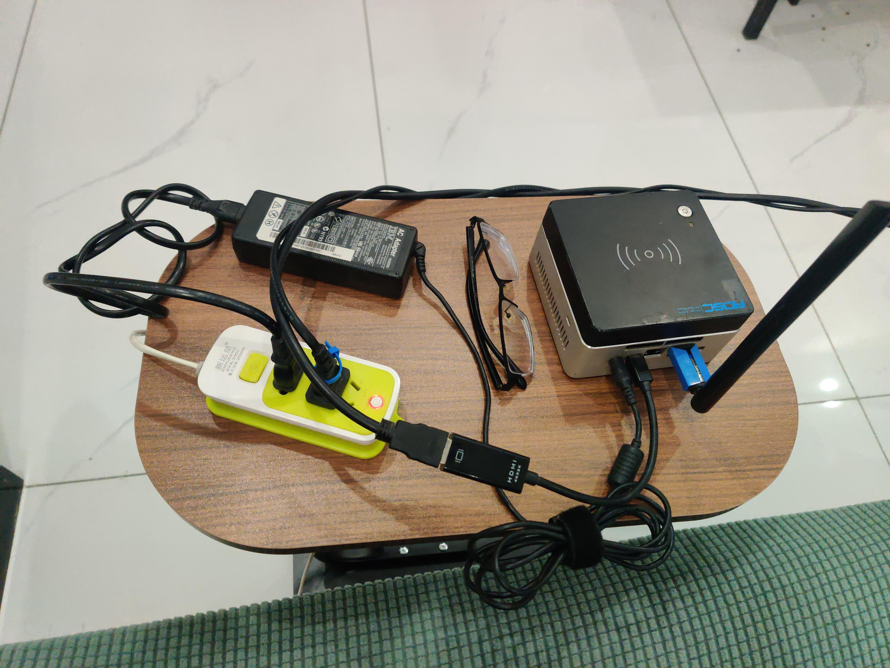
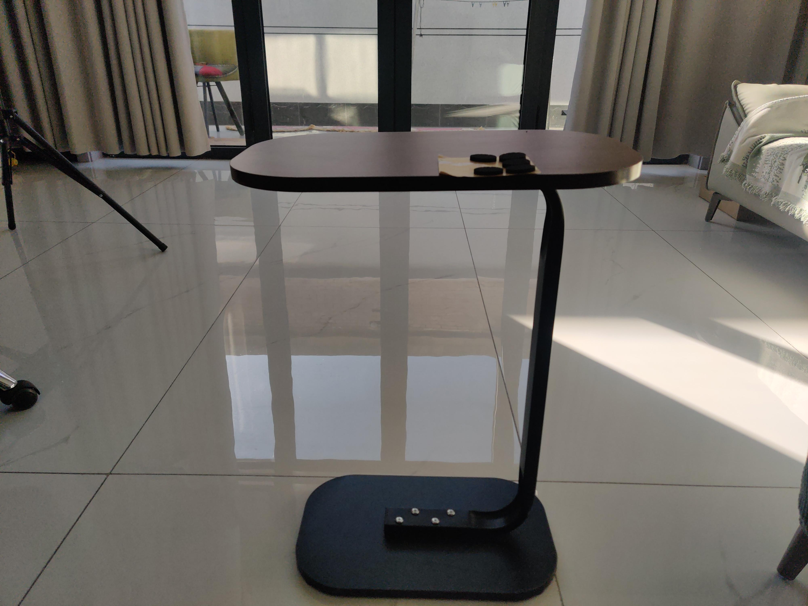
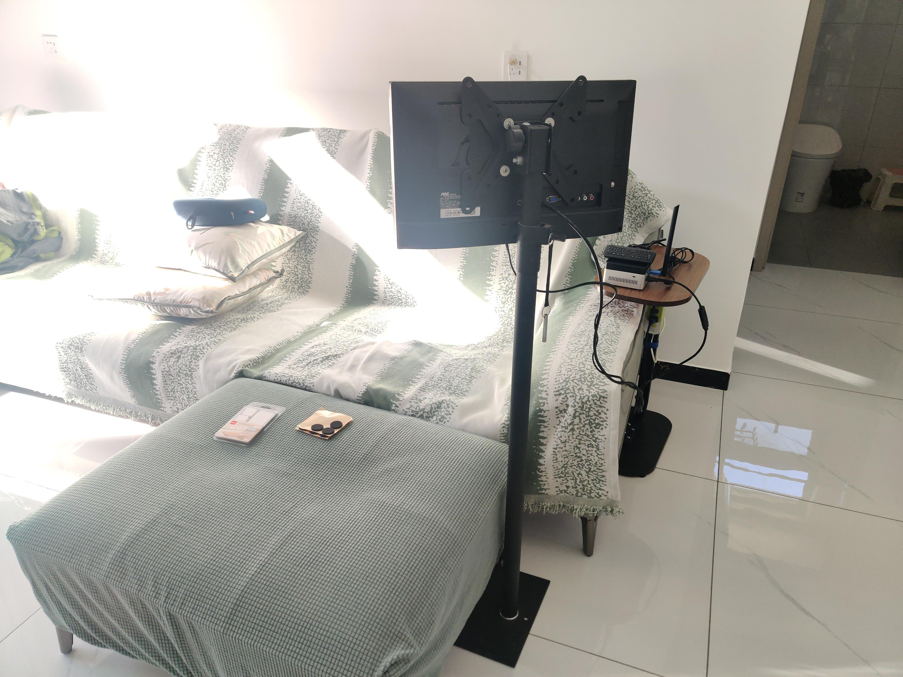

所以，图片的压缩仍然很纠结什么的。。。

<!--more-->

新家还没买电视，然后我的需要也只是偶尔躺沙发上看下视频，有个 nuc4 小主机，然后一个落地支架的显示器，所以买了个边桌放小主机。。

边桌就不太平，还会被扫地机推动，又额外买了防滑脚垫「图 ②」，，顺便买了双面贴把插排粘在边桌下面。。

最终效果如「图 ③」，，较低的那一侧实际贴了双层脚垫还是没救回多少，就这样吧。。

最后的问题是显示器没办法更低了，也不能弯折到视角正前方。。

↑ 图 ①

↑ 图 ②

↑ 图 ③

> 「JavaScript」常用图片比例生成\_电脑网络\_沉冰浮水
>
> [https://www.wdssmq.com/post/20201121554.html](https://www.wdssmq.com/post/20201121554.html "「JavaScript」常用图片比例生成\_电脑网络\_沉冰浮水")

> Pic Smaller – Compress JPEG, PNG, WEBP, AVIF, SVG and GIF images intelligently
>
> [https://txx.cssrefs.com/](https://txx.cssrefs.com/ "Pic Smaller – Compress JPEG, PNG, WEBP, AVIF, SVG and GIF images intelligently")
