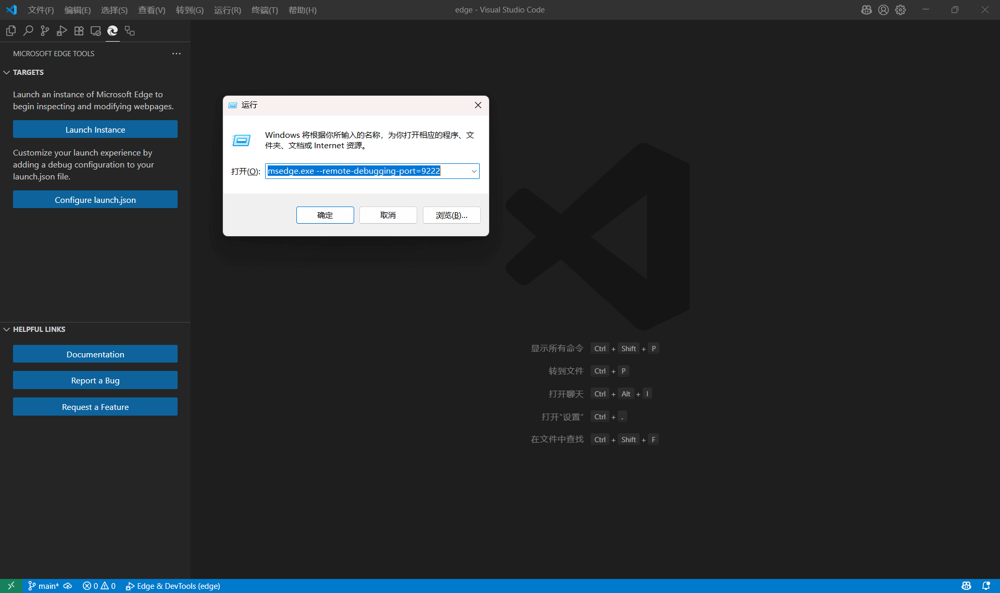
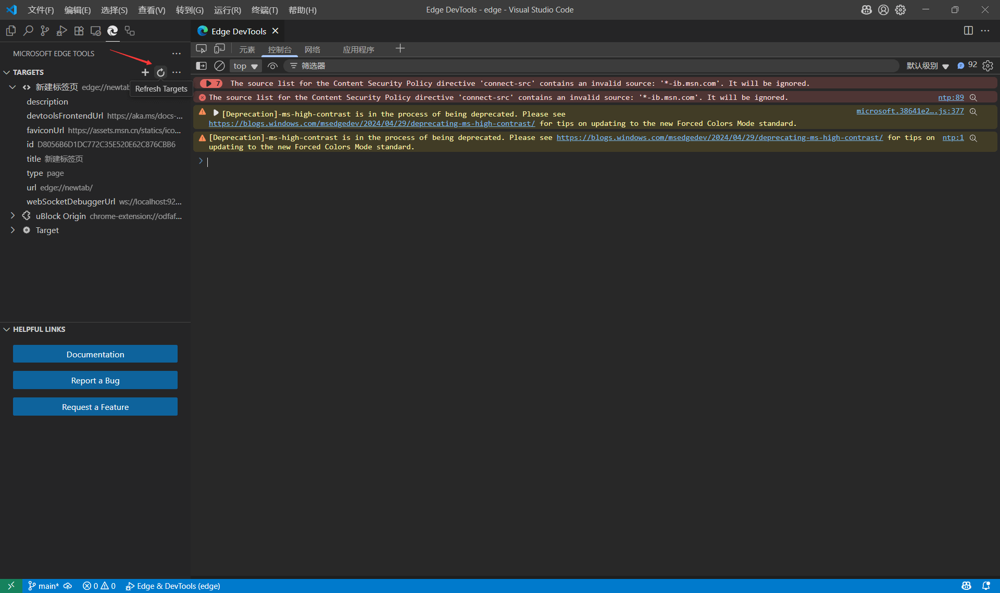
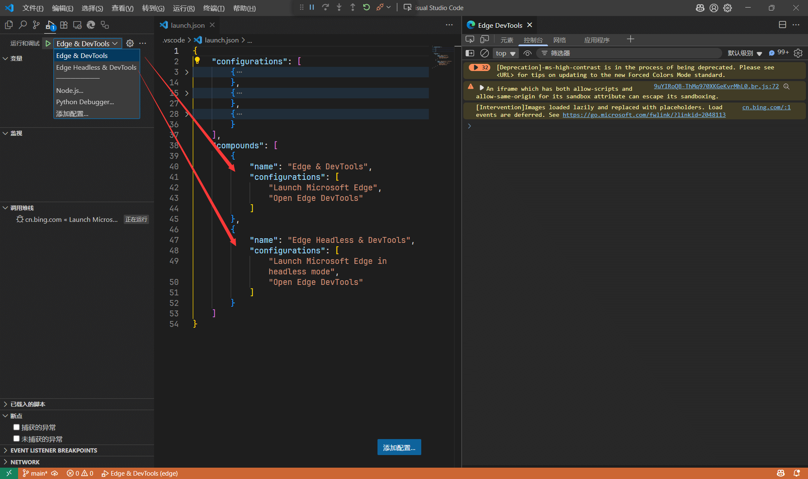

就。。久违的水文。。。

<!--more-->

终于稍微研究了下「`Microsoft Edge Tools for VS Code`」这个 VSCode 扩展怎么用，重点是能否实现我预期的使用姿势；

写「GM_脚本」比较多，用 rollup 实现了相应的打包及 dev 模式热更新，所以调试的目标非本地，然后也需要浏览器开启所需的扩展；

姑且是双显示器，然而习惯把浏览器的 DevTools 独立出来，所以常驻窗口有三个，所以就希望让 VSCode 承担 DevTools 的功能，作为标签页的形式存在。

目测是可以实现的。。

「- -」「- -」「- -」「- -」

## 方式一

1. 安装「`Microsoft Edge Tools for VS Code`」扩展；
2. 使用 `msedge.exe --remote-debugging-port=9222` 命令启动 Edge 浏览器；(**图 ①**)
  - 可访问 `http://localhost:9222/json/list` 查看开启效果，也可根据下一步操作来验证；
  - 如果不能访问，需要结束所有 Edge 进程，然后重试启动命令；
3. 在 VSCode 中进入 `Microsoft Edge Tools` 面板；(**图 ②**)
  - 点击 `Refresh Targets` 按钮以连接或刷新目标；
  - 如果连接成功，可在要调试的目标页面上「`右键`」相应选项以打开 DevTools；

附：实际可使用单独的配置路径用于开发，禁用账号数据同步和首次启动检查等，命令如下：

```bash
msedge.exe --user-data-dir=C:/config/dev/edge-data --remote-debugging-port=9222 --disable-sync --no-first-run --no-default-browser-check

```

图①↓



图②↓



「- -」「- -」「- -」「- -」

## 方式二

也可以生成 `launch.json` 配置文件，在 VSCode 中直接启动 Edge 浏览器并实现 DevTools 的连接；（**图 ③**）

**注**：在已经配置好 `launch.json` 后，不要使用「Edge Tools」中的 `Launch Project` 按钮执行，而是在「**运行和调试**」面板中选取相应的配置进行启动。



下边是完整的配置参考，`presentation.hidden` 用于控制是否在「运行和调试」面板中显示该命令项，「启动 edge」和「打开 DevTools」是两个步骤，在 `compounds` 中组合执行；

这种方式启动的 Edge 窗口默认使用独立的「用户配置路径」目录，可通过 `edge://version/` 查看（默认在 VSCode 的工作区配置内），可使用 `userDataDir` 参数指定，实际测试这种方式会加各种限制参数，谷歌之类的站点会不让登录；

```json
{
    "configurations": [
        {
            "type": "msedge",
            "name": "Launch Microsoft Edge",
            "request": "launch",
            "url": "https://bing.com",
            "runtimeArgs": [
                "--remote-debugging-port=9222"
            ],
            // "userDataDir": "C:/config/dev/edge-data",
            "presentation": {
                "hidden": true
            }
        },
        {
            "type": "msedge",
            "name": "Launch Microsoft Edge in headless mode",
            "request": "launch",
            "url": "https://bing.com",
            "runtimeArgs": [
                "--headless",
                "--remote-debugging-port=9222"
            ],
            // "userDataDir": "C:/config/dev/edge-data",
            "presentation": {
                "hidden": true
            }
        },
        {
            "type": "vscode-edge-devtools.debug",
            "name": "Open Edge DevTools",
            "request": "attach",
            "url": "https://bing.com",
            "presentation": {
                "hidden": true
            }
        }
    ],
    "compounds": [
        {
            "name": "Edge & DevTools",
            "configurations": [
                "Launch Microsoft Edge",
                "Open Edge DevTools"
            ]
        },
        {
            "name": "Edge Headless & DevTools",
            "configurations": [
                "Launch Microsoft Edge in headless mode",
                "Open Edge DevTools"
            ]
        }
    ]
}

```

